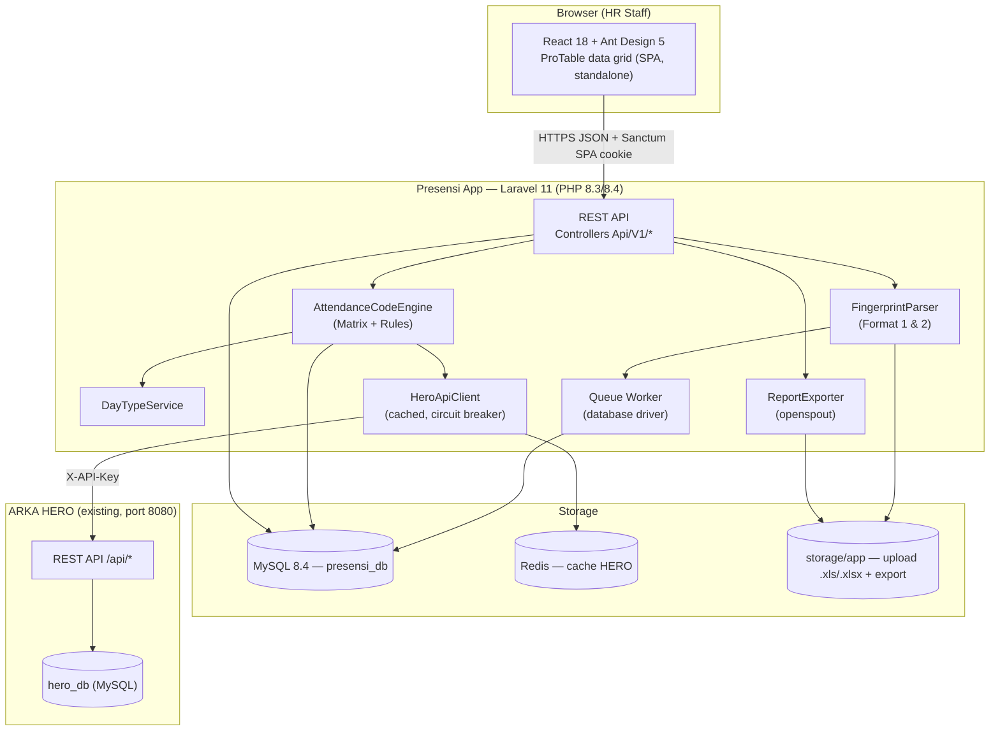
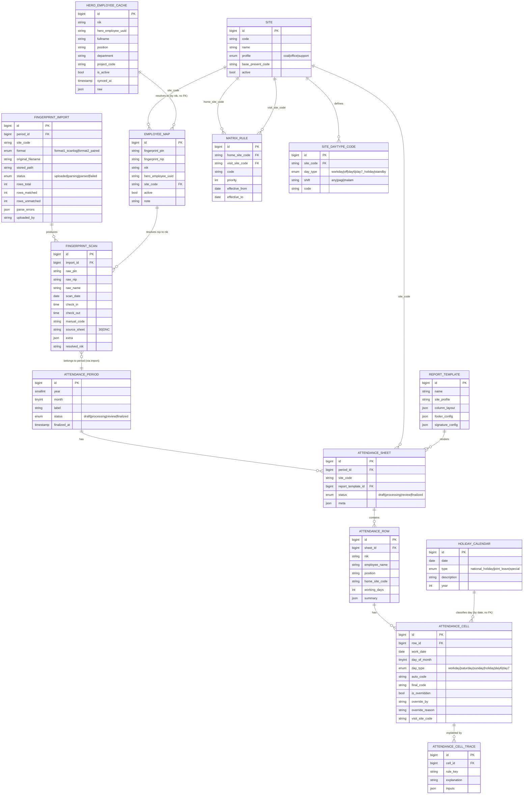

# ARKA PRESENSI — Detailed Implementation Action Plan

> **Status dokumen:** Siap eksekusi — dibuat untuk memandu agent Cursor (composer-2.5) melakukan implementasi tanpa perlu menebak keputusan desain.
> **Sumber:** `docs/concept.md` (konsep disetujui Iwan), `.cursorrules` (aturan proyek), analisis langsung file contoh Juni 2026 di `/tmp/email_attachments/`, `kode-absensi-matrix.md`, `HERO-api-reference-update2.md`.
> **Cara pakai:** Setiap Fase → Step di §11 dieksekusi berurutan. Setiap step mereferensi bagian lain dokumen ini (migration spec, model spec, route spec, dst.) — **jangan menebak nama kolom/route/kelas**, semua sudah didefinisikan di sini.

---

## Daftar Isi

1. [Project Context Summary](#1-project-context-summary)
2. [Architecture Reference](#2-architecture-reference)
3. [ERD (Mermaid)](#3-erd-mermaid)
4. [Complete Route List](#4-complete-route-list)
5. [Migration Plan](#5-migration-plan)
6. [Seed Data Plan](#6-seed-data-plan)
7. [Model List with Relationships](#7-model-list-with-relationships)
8. [Service Classes](#8-service-classes)
9. [Jobs (Queue)](#9-jobs-queue)
10. [Frontend Component Tree](#10-frontend-component-tree)
11. [Phase-by-Phase Breakdown](#11-phase-by-phase-breakdown)
12. [Testing Plan](#12-testing-plan)
13. [Conventions](#13-conventions)
14. [Open Items to Flag](#14-open-items-to-flag)
15. [Appendix: Data Analysis Findings](#15-appendix-data-analysis-findings)

---

## 1. Project Context Summary

**ARKA PRESENSI** adalah aplikasi web yang mengubah proses pengisian absensi bulanan HR — saat ini manual, mencocokkan ribuan sel terhadap matriks kode cetak — menjadi otomatis: meng-ingest data scan mesin fingerprint (dua format berbeda), menjalankan **Attendance Code Engine** deterministik (matriks visit-site + aturan lembur + kode cuti dari **ARKA HERO**), menyajikan grid review bulanan untuk HR melakukan override manual dengan alasan tercatat, lalu mengekspor laporan Excel identik format yang berlaku hari ini (per site: HO, APS, Coal, dst). **Status saat ini: GREENFIELD** — belum ada baris kode; konsep telah disetujui Iwan (lihat 11 keputusan di `docs/concept.md` §11, sebagian masih **open** — lihat §14 dokumen ini). Presensi App **tidak** menduplikasi master data karyawan/proyek/cuti — semua dikonsumsi read-only dari **ARKA HERO API** dan di-cache lokal untuk resiliensi.

---

## 2. Architecture Reference



- **Database:** `presensi_db` (MySQL 8.4) — **terpisah** dari `hero_db`, server sama.
- **Stack:** Laravel 11 (PHP 8.3/8.4 — pin, jangan 8.5) + React 18 + AntD 5 (ProTable/ProForm/ProLayout) + Redis (cache + queue opsional) + Docker (VPS, Tailscale Funnel).
- **Frontend adalah SPA standalone** (bukan Inertia) → autentikasi via **Laravel Sanctum SPA mode** (cookie-based, `stateful` domains), bukan token Bearer manual.
- **Queue driver:** `database` (Fase 0/1, tanpa setup tambahan) — bisa dipindah ke `redis` di Fase 2 bila volume naik.
- **Excel:** `openspout/openspout` untuk **export** XLSX (ringan, tanpa isu PHP 8.5); `phpoffice/phpspreadsheet` untuk **import/parse** `.xls` legacy (mesin fingerprint & sheet berformat lama).

---

## 3. ERD (Mermaid)

Nama tabel di Laravel memakai konvensi **snake_case plural** (`sites`, bukan `SITE`). Mapping nama konseptual (`docs/concept.md`) → nama tabel fisik dicantumkan di §5.



---

## 4. Complete Route List

Semua route di-prefix `/api` (grup `api`, middleware `auth:sanctum` kecuali disebut publik). Namespace controller: `App\Http\Controllers\Api\V1\*`. Nama route memakai prefix `api.` (mis. `api.periods.index`). Tidak ada controller `Web\*` — frontend adalah SPA terpisah yang hanya konsumsi JSON; satu-satunya rute non-API adalah endpoint bawaan Sanctum `GET /sanctum/csrf-cookie` (didaftarkan otomatis oleh package, tidak perlu didefinisikan manual).

### 4.1 Auth (Sanctum SPA)

| Method | Path | Controller@method | Route name | Middleware |
| --- | --- | --- | --- | --- |
| POST | `/api/auth/login` | `AuthController@login` | `api.auth.login` | `guest` |
| POST | `/api/auth/logout` | `AuthController@logout` | `api.auth.logout` | `auth:sanctum` |
| GET | `/api/auth/me` | `AuthController@me` | `api.auth.me` | `auth:sanctum` |

### 4.2 Import Fingerprint

| Method | Path | Controller@method | Route name |
| --- | --- | --- | --- |
| GET | `/api/sheets/{sheet}/imports` | `FingerprintImportController@index` | `api.imports.index` |
| POST | `/api/sheets/{sheet}/imports` | `FingerprintImportController@store` | `api.imports.store` |
| GET | `/api/imports/{import}` | `FingerprintImportController@show` | `api.imports.show` |
| GET | `/api/imports/{import}/preview` | `FingerprintImportController@preview` | `api.imports.preview` |
| GET | `/api/imports/{import}/errors` | `FingerprintImportController@errors` | `api.imports.errors` |
| GET | `/api/imports/{import}/status` | `FingerprintImportController@status` | `api.imports.status` |
| POST | `/api/imports/{import}/reparse` | `FingerprintImportController@reparse` | `api.imports.reparse` |
| DELETE | `/api/imports/{import}` | `FingerprintImportController@destroy` | `api.imports.destroy` |

### 4.3 Employee Mapping

| Method | Path | Controller@method | Route name |
| --- | --- | --- | --- |
| GET | `/api/employee-maps` | `EmployeeMapController@index` | `api.employee-maps.index` |
| POST | `/api/employee-maps` | `EmployeeMapController@store` | `api.employee-maps.store` |
| PUT | `/api/employee-maps/{employeeMap}` | `EmployeeMapController@update` | `api.employee-maps.update` |
| DELETE | `/api/employee-maps/{employeeMap}` | `EmployeeMapController@destroy` | `api.employee-maps.destroy` |
| POST | `/api/employee-maps/bulk` | `EmployeeMapController@bulkStore` | `api.employee-maps.bulk` |
| GET | `/api/employee-maps/unmatched` | `EmployeeMapController@unmatched` | `api.employee-maps.unmatched` |
| GET | `/api/employee-maps/suggest` | `EmployeeMapController@suggest` | `api.employee-maps.suggest` |

### 4.4 Attendance Engine (Period / Sheet / Generate)

| Method | Path | Controller@method | Route name |
| --- | --- | --- | --- |
| GET | `/api/periods` | `AttendancePeriodController@index` | `api.periods.index` |
| POST | `/api/periods` | `AttendancePeriodController@store` | `api.periods.store` |
| GET | `/api/periods/{period}` | `AttendancePeriodController@show` | `api.periods.show` |
| GET | `/api/periods/{period}/sheets` | `AttendanceSheetController@index` | `api.sheets.index` |
| POST | `/api/periods/{period}/sheets` | `AttendanceSheetController@store` | `api.sheets.store` |
| GET | `/api/sheets/{sheet}` | `AttendanceSheetController@show` | `api.sheets.show` |
| POST | `/api/sheets/{sheet}/generate` | `AttendanceSheetController@generate` | `api.sheets.generate` |
| GET | `/api/sheets/{sheet}/generate-status` | `AttendanceSheetController@generateStatus` | `api.sheets.generate-status` |
| POST | `/api/sheets/{sheet}/finalize` | `AttendanceSheetController@finalize` | `api.sheets.finalize` |
| POST | `/api/sheets/{sheet}/reopen` | `AttendanceSheetController@reopen` | `api.sheets.reopen` |

### 4.5 Review & Override

| Method | Path | Controller@method | Route name |
| --- | --- | --- | --- |
| GET | `/api/sheets/{sheet}/grid` | `AttendanceGridController@index` | `api.grid.index` |
| GET | `/api/cells/{cell}` | `AttendanceCellController@show` | `api.cells.show` |
| PUT | `/api/cells/{cell}` | `AttendanceCellController@update` | `api.cells.update` |
| GET | `/api/cells/{cell}/trace` | `AttendanceCellController@trace` | `api.cells.trace` |
| POST | `/api/sheets/{sheet}/cells/bulk-update` | `AttendanceCellController@bulkUpdate` | `api.cells.bulk-update` |

### 4.6 Report Export

| Method | Path | Controller@method | Route name |
| --- | --- | --- | --- |
| GET | `/api/sheets/{sheet}/export` | `ReportExportController@export` | `api.export.download` |
| GET | `/api/sheets/{sheet}/export/preview` | `ReportExportController@preview` | `api.export.preview` |

### 4.7 Admin Config

| Method | Path | Controller@method | Route name |
| --- | --- | --- | --- |
| `apiResource` | `/api/sites` | `SiteController` | `api.sites.*` |
| `apiResource` | `/api/matrix-rules` | `MatrixRuleController` | `api.matrix-rules.*` |
| GET | `/api/matrix-rules/grid` | `MatrixRuleController@grid` | `api.matrix-rules.grid` |
| `apiResource` | `/api/site-daytype-codes` | `SiteDaytypeCodeController` | `api.site-daytype-codes.*` |
| `apiResource` | `/api/holiday-calendars` | `HolidayCalendarController` | `api.holiday-calendars.*` |
| POST | `/api/holiday-calendars/import` | `HolidayCalendarController@import` | `api.holiday-calendars.import` |
| `apiResource` | `/api/report-templates` | `ReportTemplateController` | `api.report-templates.*` |

### 4.8 HERO Sync

| Method | Path | Controller@method | Route name |
| --- | --- | --- | --- |
| POST | `/api/hero/sync` | `HeroSyncController@sync` | `api.hero.sync` |
| GET | `/api/hero/sync/status` | `HeroSyncController@status` | `api.hero.sync-status` |
| GET | `/api/hero/employees` | `HeroSyncController@cachedEmployees` | `api.hero.employees` |

### 4.9 Dashboard (Fase 2)

| Method | Path | Controller@method | Route name |
| --- | --- | --- | --- |
| GET | `/api/dashboard/summary` | `DashboardController@summary` | `api.dashboard.summary` |

---

## 5. Migration Plan

Jalankan `php artisan make:migration <nama>` untuk tiap file (bukan `touch`/`mkdir`). Urutan **wajib** karena foreign key.

```
Phase 0 migrations:
  1. create_sites_table
  2. create_matrix_rules_table
  3. create_site_daytype_codes_table
  4. create_holiday_calendars_table
  5. create_report_templates_table
  6. create_hero_employee_caches_table
  7. create_employee_maps_table
  8. create_attendance_periods_table
  9. create_attendance_sheets_table
  10. create_attendance_rows_table
  11. create_attendance_cells_table
  12. create_attendance_cell_traces_table
  13. create_fingerprint_imports_table
  14. create_fingerprint_scans_table
```

### 5.1 `create_sites_table` → tabel `sites`

| Kolom | Tipe | Constraint |
| --- | --- | --- |
| id | bigIncrements | PK |
| code | string(10) | unique, not null (`017C\|021C\|022C\|023C\|025C\|BO\|HO\|APS`) |
| name | string(150) | not null |
| profile | enum('coal','office','support') | not null |
| base_present_code | string(20) | not null (kode "Kode Hadir bekerja") |
| active | boolean | default true |
| timestamps | | |

Index: `unique(code)`.

### 5.2 `create_matrix_rules_table` → tabel `matrix_rules`

| Kolom | Tipe | Constraint |
| --- | --- | --- |
| id | bigIncrements | PK |
| home_site_code | string(10) | not null, FK → `sites.code` (`onUpdate cascade`) |
| visit_site_code | string(10) | not null, FK → `sites.code` |
| code | string(20) | not null |
| priority | integer | default 0 |
| effective_from | date | not null |
| effective_to | date | nullable |
| timestamps | | |

Index: `index(['home_site_code','visit_site_code','effective_from'])`, `unique(['home_site_code','visit_site_code','effective_from'])` (satu aturan aktif per kombinasi per tanggal mulai).

### 5.3 `create_site_daytype_codes_table` → tabel `site_daytype_codes`

| Kolom | Tipe | Constraint |
| --- | --- | --- |
| id | bigIncrements | PK |
| site_code | string(10) | FK → `sites.code` |
| day_type | enum('workday','off','day6','day7_holiday','standby') | not null |
| shift | string(20) | default `'any'` (`any\|pagi\|malam`) |
| code | string(20) | not null |
| timestamps | | |

Index: `unique(['site_code','day_type','shift'])`.

### 5.4 `create_holiday_calendars_table` → tabel `holiday_calendars`

| Kolom | Tipe | Constraint |
| --- | --- | --- |
| id | bigIncrements | PK |
| date | date | unique, not null |
| type | enum('national_holiday','joint_leave','special') | not null |
| description | string(255) | nullable |
| year | smallInteger | not null |
| timestamps | | |

Index: `index(year)`.

### 5.5 `create_report_templates_table` → tabel `report_templates`

| Kolom | Tipe | Constraint |
| --- | --- | --- |
| id | bigIncrements | PK |
| name | string(50) | unique, not null (`STAFF_HO\|STAFF_APS\|COAL_017C`) |
| site_profile | string(20) | not null |
| column_layout | json | not null |
| footer_config | json | nullable |
| signature_config | json | nullable |
| timestamps | | |

### 5.6 `create_hero_employee_caches_table` → tabel `hero_employee_caches`

| Kolom | Tipe | Constraint |
| --- | --- | --- |
| id | bigIncrements | PK |
| nik | string(20) | unique, not null |
| hero_employee_uuid | string(36) | nullable, index |
| fullname | string(150) | not null |
| position | string(150) | nullable |
| department | string(150) | nullable |
| project_code | string(10) | nullable, index (home site) |
| is_active | boolean | default true |
| synced_at | timestamp | nullable |
| raw | json | nullable (payload mentah dari HERO) |
| timestamps | | |

### 5.7 `create_employee_maps_table` → tabel `employee_maps`

| Kolom | Tipe | Constraint |
| --- | --- | --- |
| id | bigIncrements | PK |
| fingerprint_pin | string(20) | not null |
| fingerprint_nip | string(20) | not null, unique |
| nik | string(20) | nullable, index |
| hero_employee_uuid | string(36) | nullable |
| site_code | string(10) | nullable, FK → `sites.code` |
| active | boolean | default true |
| note | string(255) | nullable |
| timestamps | | |

Index: `unique(fingerprint_nip)` (satu NIP = satu mapping kanonik), `index(nik)`.

### 5.8 `create_attendance_periods_table` → tabel `attendance_periods`

| Kolom | Tipe | Constraint |
| --- | --- | --- |
| id | bigIncrements | PK |
| year | smallInteger | not null |
| month | tinyInteger | not null |
| label | string(50) | not null (mis. "Juni 2026") |
| status | enum('draft','processing','review','finalized') | default `'draft'` |
| finalized_at | timestamp | nullable |
| timestamps | | |

Index: `unique(['year','month'])`.

### 5.9 `create_attendance_sheets_table` → tabel `attendance_sheets`

| Kolom | Tipe | Constraint |
| --- | --- | --- |
| id | bigIncrements | PK |
| period_id | foreignId | FK → `attendance_periods.id`, `cascadeOnDelete` |
| site_code | string(10) | not null, FK → `sites.code` |
| report_template_id | foreignId | nullable, FK → `report_templates.id` |
| status | enum('draft','processing','review','finalized') | default `'draft'` |
| meta | json | nullable (`prepared_by, approved_by, doc_no, rev`) |
| timestamps | | |

Index: `unique(['period_id','site_code'])`.

### 5.10 `create_attendance_rows_table` → tabel `attendance_rows`

| Kolom | Tipe | Constraint |
| --- | --- | --- |
| id | bigIncrements | PK |
| sheet_id | foreignId | FK → `attendance_sheets.id`, `cascadeOnDelete` |
| nik | string(20) | not null |
| employee_name | string(150) | not null |
| position | string(150) | nullable |
| home_site_code | string(10) | nullable |
| working_days | integer | default 0 |
| summary | json | nullable (`HOS2,HOA2,1901..1906,SCB,SC1,Kosong,TOTAL`) |
| timestamps | | |

Index: `unique(['sheet_id','nik'])`.

### 5.11 `create_attendance_cells_table` → tabel `attendance_cells`

| Kolom | Tipe | Constraint |
| --- | --- | --- |
| id | bigIncrements | PK |
| row_id | foreignId | FK → `attendance_rows.id`, `cascadeOnDelete` |
| work_date | date | not null |
| day_of_month | tinyInteger | not null |
| day_type | enum('workday','saturday','sunday','holiday','day6','day7') | not null |
| auto_code | string(20) | nullable |
| final_code | string(20) | nullable |
| is_overridden | boolean | default false |
| override_by | string(100) | nullable |
| override_reason | string(255) | nullable |
| visit_site_code | string(10) | nullable |
| timestamps | | |

Index: `unique(['row_id','work_date'])`, `index(work_date)`.

### 5.12 `create_attendance_cell_traces_table` → tabel `attendance_cell_traces`

| Kolom | Tipe | Constraint |
| --- | --- | --- |
| id | bigIncrements | PK |
| cell_id | foreignId | FK → `attendance_cells.id`, `cascadeOnDelete` |
| rule_key | string(100) | not null (`matrix.visit\|leave.1901\|overtime.HOS2\|daytype.weekend`) |
| explanation | string(255) | not null |
| inputs | json | not null |
| created_at | timestamp | (immutable audit log — tidak perlu `updated_at`, gunakan `$table->timestamp('created_at')->useCurrent()`) |

Index: `index(cell_id)`.

### 5.13 `create_fingerprint_imports_table` → tabel `fingerprint_imports`

| Kolom | Tipe | Constraint |
| --- | --- | --- |
| id | bigIncrements | PK |
| period_id | foreignId | FK → `attendance_periods.id` |
| site_code | string(10) | not null |
| format | enum('format1_scanlog','format2_paired') | not null |
| original_filename | string(255) | not null |
| stored_path | string(255) | not null |
| status | enum('uploaded','parsing','parsed','failed') | default `'uploaded'` |
| rows_total | integer | default 0 |
| rows_matched | integer | default 0 |
| rows_unmatched | integer | default 0 |
| parse_errors | json | nullable |
| uploaded_by | string(100) | nullable |
| timestamps | | |

### 5.14 `create_fingerprint_scans_table` → tabel `fingerprint_scans`

| Kolom | Tipe | Constraint |
| --- | --- | --- |
| id | bigIncrements | PK |
| import_id | foreignId | FK → `fingerprint_imports.id`, `cascadeOnDelete` |
| raw_pin | string(20) | not null |
| raw_nip | string(20) | not null |
| raw_name | string(150) | nullable |
| scan_date | date | not null |
| check_in | time | nullable |
| check_out | time | nullable |
| manual_code | string(20) | nullable (jika sel Format 2 berisi kode `1901`, dst.) |
| source_sheet | string(20) | nullable (`30\|DNC`) |
| extra | json | nullable (`visit_ke, belum_berkas, terlambat`) |
| resolved_nik | string(20) | nullable, index |
| timestamps | | |

Index: `index(['import_id','scan_date'])`, `index(raw_nip)`.

---

## 6. Seed Data Plan

Buat via `php artisan make:seeder <Nama>Seeder`, daftarkan semua di `DatabaseSeeder::run()`.

### 6.1 `SiteSeeder`

8 site dari `kode-absensi-matrix.md` + `docs/concept.md` §9.3. `base_present_code` = kolom "Kode Hadir bekerja".

| code | name (placeholder — konfirmasi ke Iwan) | profile | base_present_code |
| --- | --- | --- | --- |
| 017C | Site 017C | coal | HAS |
| 021C | Site 021C | coal | HO1 |
| 022C | Site 022C | coal | HAS |
| 023C | Site 023C | coal | HAS |
| 025C | Site 025C | coal | HO1 |
| BO | Branch Office | office | HO1 |
| HO | Head Office | office | HO2 |
| APS | Arka Project Support | support | HO2 |

### 6.2 `MatrixRuleSeeder`

Matriks penuh 8×8 dari `kode-absensi-matrix.md` (tabel utama + kolom/baris tulisan tangan 025C), `effective_from = 2025-01-01`, `effective_to = null`, `priority = 0`. Diagonal (home = visit) diisi `base_present_code` site tersebut.

| home_site_code | visit_site_code | code |
| --- | --- | --- |
| 017C | 017C | HAS |
| 017C | BO | HS |
| 017C | HO | HS |
| 017C | APS | HS |
| 017C | 021C | HS |
| 017C | 022C | HAS |
| 017C | 023C | HAS |
| 017C | 025C | HS |
| 021C | 021C | HO1 |
| 021C | BO | HO1 |
| 021C | HO | HOS1 |
| 021C | APS | HOS1 |
| 021C | 017C | HOA1 |
| 021C | 022C | HOA1 |
| 021C | 023C | HOA1 |
| 021C | 025C | HOS1 |
| 022C | 022C | HAS |
| 022C | BO | HS |
| 022C | HO | HS |
| 022C | APS | HS |
| 022C | 021C | HS |
| 022C | 017C | HAS |
| 022C | 023C | HAS |
| 022C | 025C | HS |
| 023C | 023C | HAS |
| 023C | BO | HS |
| 023C | HO | HS |
| 023C | APS | HS |
| 023C | 021C | HS |
| 023C | 017C | HAS |
| 023C | 022C | HAS |
| 023C | 025C | HS |
| BO | BO | HO1 |
| BO | HO | HOS1 |
| BO | APS | HOS1 |
| BO | 017C | HOA1 |
| BO | 021C | HO1 |
| BO | 022C | HOA1 |
| BO | 023C | HOA1 |
| BO | 025C | HOS1 |
| HO | HO | HO2 |
| HO | BO | HOS2 |
| HO | APS | HO2 |
| HO | 017C | HOA2 |
| HO | 021C | HOS2 |
| HO | 022C | HOA2 |
| HO | 023C | HOA2 |
| HO | 025C | HOS2 |
| APS | APS | HO2 |
| APS | BO | HOS2 |
| APS | HO | HO2 |
| APS | 017C | HOA2 |
| APS | 021C | HOS2 |
| APS | 022C | HOA2 |
| APS | 023C | HOA2 |
| APS | 025C | HOS2 |
| 025C | 025C | HO1 |
| 025C | BO | HOS1 |
| 025C | HO | HOS1 |
| 025C | APS | HOS1 |
| 025C | 017C | HOA1 |
| 025C | 021C | HOS1 |
| 025C | 022C | HOA1 |
| 025C | 023C | HOA1 |

> **Catatan implementasi:** 022C dan 023C untuk visit ke `017C/022C/023C` bertanda ✓ di dokumen asli (nilai sama, `HAS`) — sudah tercermin di tabel di atas. Baris **025C** hanya punya kolom BO/HO/APS/017C-022C-023C/021C (tidak ada 025C→025C eksplisit di sumber asli selain "Kode Hadir bekerja" = `HO1`) — sudah diisi sebagai diagonal.

### 6.3 `SiteDaytypeCodeSeeder`

Dari `kode-absensi-matrix.md` bagian "kode per Site Project":

| site_code | day_type | shift | code |
| --- | --- | --- | --- |
| 017C | workday | pagi | 11 |
| 017C | workday | malam | 11/NS |
| 017C | off | any | SCB |
| 017C | day6 | pagi | 11A |
| 017C | day6 | malam | 11/NSA |
| 017C | day7_holiday | pagi | 11B |
| 017C | day7_holiday | malam | 11/NSB |
| 017C | standby | any | 7 |
| 021C | workday | any | 7 |
| 021C | off | any | SCB |
| 021C | standby | any | 7 |
| 022C | workday | any | 11 |
| 022C | off | any | SCB |
| 022C | day6 | any | 11A |
| 022C | day7_holiday | any | 11B |
| 022C | standby | any | 7 |
| 023C | workday | any | 11 |
| 023C | off | any | SCB |
| 023C | day6 | any | 11A |
| 023C | day7_holiday | any | 11B |
| 023C | standby | any | 7 |
| APS | workday | any | 8 |
| APS | off | any | SCB |
| APS | day6 | any | 7B |
| APS | day7_holiday | any | B |
| APS | standby | any | 7 |

> **021C** tidak punya kode `day6`/`day7_holiday` di sumber (kosong di dokumen asli) — jangan buat baris untuk kombinasi tersebut, biarkan `MatrixResolver`/`DayTypeService` fallback ke kode kosong + flag "perlu konfirmasi" bila terjadi. **HO/BO/025C** tidak muncul di tabel ini (mereka staff kantor yang pakai matriks visit-site langsung, bukan shift tambang) — jangan seed baris untuk site tersebut kecuali Iwan konfirmasi ada.

### 6.4 `HolidayCalendarSeeder`

Seed hari libur nasional 2026 (sumber resmi: SKB 3 Menteri RI — **perlu konfirmasi list final ke Iwan**, lihat §14). Minimal untuk regression test Juni 2026, cek kalender resmi 2026 untuk bulan Juni (idul adha kemungkinan sekitar akhir Mei/awal Juni 2026 — **verifikasi tanggal pasti sebelum seed**, jangan menebak). Struktur seeder:

```php
['date' => '2026-01-01', 'type' => 'national_holiday', 'description' => 'Tahun Baru Masehi', 'year' => 2026],
// ... isi lengkap 2026 setelah verifikasi kalender resmi
```

### 6.5 `ReportTemplateSeeder`

Dua entri minimal (`STAFF_HO`, `STAFF_APS`), berdasarkan struktur nyata dari `expected_result-*` (lihat §15.3/§15.4 untuk detail kolom persis).

```php
[
    'name' => 'STAFF_HO',
    'site_profile' => 'office',
    'column_layout' => [
        'frozen' => ['No', 'Nama', 'NIK', 'Position'],
        'date_columns' => 30, // 1..N hari sesuai jumlah hari di bulan
        'summary_groups' => [
            ['label' => 'LEMBUR STAFF', 'columns' => ['HOS2', 'HOA2', 'TOTAL']],
            ['columns' => ['1901', '1902', '1903', '1904', '1905', '1906']],
            ['columns' => ['SC1', 'TOTAL']],
        ],
    ],
    'footer_config' => [
        'keterangan' => [
            'Terlambat', 'Tidak Finger Print Masuk', 'Tidak Finger Print Keluar',
            'ID Ketinggalan', 'Visit ke APS', 'Belum ada Berkas Pendukung (LOT/Form Cuti/Surat Sakit)',
            'Belum ada kabar',
        ],
    ],
    'signature_config' => [
        'blocks' => ['Prepared,', 'Checked,', 'Approved,'],
        'doc_no' => 'ARKA/HCS/IV/02.01',
        'rev' => 'Rev.1',
    ],
],
[
    'name' => 'STAFF_APS',
    'site_profile' => 'support',
    'column_layout' => [
        'title' => 'ABSENSI KARYAWAN PERIODE {from} - {to} {bulan_tahun} (ARKA PROJECT SUPPORT# APS)',
        'frozen' => ['NO', 'Nama', 'NIK', 'Position'],
        'date_columns' => 30,
        'summary_groups' => [
            ['columns' => ['Sabtu', 'HOS2', 'HOA2', '1901', '1902', '1903', '1904', '1905', '1906', 'SCB', 'Kosong', 'TOTAL', 'HARI KERJA']],
        ],
    ],
    'footer_config' => ['totals_row' => true],
    'signature_config' => [
        'blocks' => ['Prepared by (HR Supervisor APS)', 'Approved By (Project Manager)'],
        'doc_no' => 'ARKA/HCS/IV/02.01',
        'rev' => 'Rev.2',
        'page' => 'Page 1/1',
    ],
],
```

---

## 7. Model List with Relationships

Semua model `App\Models\*`, generate via `php artisan make:model <Nama>` (jangan `touch`). Gunakan `casts()` method (Laravel 11 style) untuk `json`/`enum`/`boolean`/`date`.

```php
class Site extends Model {
    // hasMany: MatrixRule (via home_site_code)
    // hasMany: SiteDaytypeCode
    // hasMany: EmployeeMap
    // hasMany: AttendanceSheet
    // columns: id, code, name, profile, base_present_code, active
}

class MatrixRule extends Model {
    // belongsTo: Site (home_site_code -> code), Site (visit_site_code -> code)
    // scope: current() -> where effective_from <= now, effective_to null OR >= now
    // columns: id, home_site_code, visit_site_code, code, priority, effective_from, effective_to
}

class SiteDaytypeCode extends Model {
    // belongsTo: Site (site_code -> code)
    // columns: id, site_code, day_type, shift, code
}

class HolidayCalendar extends Model {
    // no direct relation (dicocokkan by date di DayTypeService)
    // columns: id, date, type, description, year
}

class ReportTemplate extends Model {
    // hasMany: AttendanceSheet
    // columns: id, name, site_profile, column_layout(json), footer_config(json), signature_config(json)
}

class HeroEmployeeCache extends Model {
    // no direct FK relation (dicocokkan by nik di EmployeeMap/AttendanceRow)
    // columns: id, nik, hero_employee_uuid, fullname, position, department, project_code, is_active, synced_at, raw(json)
}

class EmployeeMap extends Model {
    // belongsTo: Site (site_code -> code)
    // hasMany: FingerprintScan (via resolved_nik... resolusi dilakukan di service, bukan FK langsung)
    // columns: id, fingerprint_pin, fingerprint_nip, nik, hero_employee_uuid, site_code, active, note
}

class AttendancePeriod extends Model {
    // hasMany: AttendanceSheet
    // hasMany: FingerprintImport
    // columns: id, year, month, label, status, finalized_at
}

class AttendanceSheet extends Model {
    // belongsTo: AttendancePeriod
    // belongsTo: ReportTemplate
    // hasMany: AttendanceRow
    // hasMany: FingerprintImport (via period_id + site_code correlation, atau tambah sheet_id nullable jika perlu langsung)
    // columns: id, period_id, site_code, report_template_id, status, meta(json)
}

class AttendanceRow extends Model {
    // belongsTo: AttendanceSheet
    // hasMany: AttendanceCell
    // columns: id, sheet_id, nik, employee_name, position, home_site_code, working_days, summary(json)
}

class AttendanceCell extends Model {
    // belongsTo: AttendanceRow
    // hasMany: AttendanceCellTrace
    // columns: id, row_id, work_date, day_of_month, day_type, auto_code, final_code, is_overridden, override_by, override_reason, visit_site_code
}

class AttendanceCellTrace extends Model {
    // belongsTo: AttendanceCell
    // const UPDATED_AT = null; (immutable log, hanya created_at)
    // columns: id, cell_id, rule_key, explanation, inputs(json), created_at
}

class FingerprintImport extends Model {
    // belongsTo: AttendancePeriod
    // hasMany: FingerprintScan
    // columns: id, period_id, site_code, format, original_filename, stored_path, status, rows_total, rows_matched, rows_unmatched, parse_errors(json), uploaded_by
}

class FingerprintScan extends Model {
    // belongsTo: FingerprintImport
    // columns: id, import_id, raw_pin, raw_nip, raw_name, scan_date, check_in, check_out, manual_code, source_sheet, extra(json), resolved_nik
}
```

`User` model tetap default Laravel (Sanctum `HasApiTokens` tidak diperlukan untuk SPA mode — cukup trait bawaan `Authenticatable`). Tambahkan kolom `role` (`enum('hr_staff','hr_supervisor','admin')`) ke migrasi `users` bawaan jika Fase 0 §11 mengharuskan role-based access (lihat keputusan #11 di `concept.md`, masih **open** — default sementara: semua user authenticated punya akses penuh, role enforcement masuk backlog Fase 1 akhir setelah Iwan konfirmasi).

---

## 8. Service Classes

Semua di `App\Services\*`, dibuat manual (file baru, bukan artisan — Laravel tidak punya `make:service` bawaan, tapi tetap ikuti PSR-4 `app/Services/`).

### 8.1 `FingerprintParser`

```php
class FingerprintParser
{
    public function detectFormat(string $path): string; // 'format1_scanlog' | 'format2_paired' — deteksi via header kolom (cek keberadaan kolom "I/O" vs "Scan masuk")
    public function parseFormat1(string $path, FingerprintImport $import): void; // agregasi I/O per NIP-hari: check_in = MIN waktu dgn I/O=1, check_out = MAX waktu dgn I/O=2
    public function parseFormat2(string $path, FingerprintImport $import): void; // baca sheet utama + sheet DNC; per baris = 1 scan; deteksi cell "kode vs jam" (regex time HH:MM:SS vs numeric)
    private function isTimeValue(mixed $cellValue): bool;
    private function isManualCode(mixed $cellValue): bool; // numeric 4-digit yang cocok kode 1901-1906 dst.
    private function resolveNik(string $rawNip, string $siteCode): ?string; // lookup EmployeeMap
}
```

- **Parsing `.xls` legacy** wajib pakai `PhpOffice\PhpSpreadsheet\Reader\Xls` (bukan openspout — openspout hanya CSV/XLSX).
- Format 1: baris kosong di baris 1, header di baris 2 (index 1), data mulai baris 3 (index 2) — **jangan hardcode row offset**, cari baris header dengan mencocokkan `Tanggal scan` di kolom pertama.
- Format 2: dua sheet (`30`, `DNC`), header sama persis di kedua sheet, baris kosong di baris 1, header di baris 2.
- Kolom `Scan masuk`/`Scan pulang` di Format 2: nilai berupa **string** `HH:MM:SS` (waktu) atau **numeric** (mis. `1901.0` = kode manual). Cocokkan tipe sel & pola regex `^\d{2}:\d{2}:\d{2}$`, bukan asumsi posisi.

### 8.2 `AttendanceCodeEngine`

```php
class AttendanceCodeEngine
{
    public function generateForSheet(AttendanceSheet $sheet): void; // loop semua AttendanceRow x tanggal di periode
    public function generateForCell(AttendanceRow $row, Carbon $date): array; // return ['auto_code' => ..., 'trace' => [...]]
    private function resolveOverride(AttendanceCell $cell): ?string; // skip jika is_overridden
    private function resolveLeave(string $nik, Carbon $date, array $heroActivity): ?array; // 1901..1906
    private function resolveDayType(string $siteCode, Carbon $date): string; // delegasi ke DayTypeService
    private function resolveOvertimeUpgrade(string $baseCode, array $overtimeData, Carbon $date): array;
    private function resolvePresenceCode(AttendanceRow $row, Carbon $date, ?string $visitSite): array; // delegasi ke MatrixResolver
}
```

Pipeline persis §9.2 `docs/concept.md` (mermaid flowchart) — urutan wajib: **override → leave/cuti → day-type (weekend/holiday/day6) → presence check → matrix lookup → overtime upgrade**. Setiap langkah menulis satu baris `AttendanceCellTrace` minimal (`rule_key`, `explanation`, `inputs` json berisi data mentah yang dipakai keputusan). **Tidak pernah** menimpa `final_code` bila `is_overridden = true`; hanya menulis ulang `auto_code`.

### 8.3 `HeroApiClient`

```php
class HeroApiClient
{
    public function getEmployees(): array; // GET /api/employees
    public function getActiveEmployees(): array; // GET /api/employees/active
    public function getEmployeeByNik(string $nik): ?array; // GET /api/employees/by-nik/{nik}
    public function getProjects(): array; // GET /api/projects
    public function getActivity(string $nik, int $year, ?int $month): array; // GET /api/workforce/employees/by-nik/{nik}/activity
    private function request(string $method, string $path, array $query = []): array; // handle X-API-Key header, timeout, retry
    private function cacheKey(string $path, array $query): string;
    private function isCircuitOpen(): bool; // circuit breaker state di Redis (mis. key hero:circuit:open, TTL)
}
```

- Cache di **Redis**, TTL disarankan: employees/projects 6 jam, activity per (nik,year,month) 30 menit (data cuti/lembur bisa berubah cepat saat approval).
- **Circuit breaker:** setelah N kegagalan berturut-turut (mis. 3x timeout), buka circuit selama 60 detik — request berikutnya langsung fallback ke `HERO_EMPLOYEE_CACHE`/cache lama tanpa mencoba HTTP.
- Auth: header `X-API-Key` dari `config('services.hero.api_key')` (env `HERO_API_KEY`).
- Normalisasi respons: HERO API tidak konsisten (`status: success` vs `success: true`) — buat helper `normalizeResponse(array $raw): array` yang selalu mengembalikan struktur seragam `{ok: bool, data: mixed}`.

### 8.4 `DayTypeService`

```php
class DayTypeService
{
    public function classify(Carbon $date, string $siteCode): string; // 'workday'|'saturday'|'sunday'|'holiday'|'day6'|'day7'
    public function isHoliday(Carbon $date): bool; // lookup HolidayCalendar
    private function isDay6(Carbon $date, string $siteCode): bool; // aturan site-specific (tambang: hari ke-6 kerja berturut)
    private function isDay7(Carbon $date, string $siteCode): bool;
}
```

> **Catatan:** definisi "hari ke-6"/"hari ke-7" untuk site tambang **butuh spesifikasi presisi dari Iwan** (siklus kerja berapa hari berturut sebelum "hari ke-6"?) — lihat §14. Untuk Fase 1 MVP (HO & APS saja, day_type cukup `workday|saturday|sunday|holiday`), implementasi `day6`/`day7` bisa **stub** (return `workday` sebagai fallback) dan ditandai `TODO` eksplisit, karena golden-file Juni 2026 HO/APS tidak memerlukan kode hari ke-6/7 (lihat §15.3–15.4, distribusi kode tidak memuat `11A/7B/dst`).

### 8.5 `ReportExporter`

```php
class ReportExporter
{
    public function export(AttendanceSheet $sheet): string; // return path file xlsx sementara, streaming write via openspout
    private function buildHeaderRows(ReportTemplate $template, AttendancePeriod $period): array;
    private function buildDataRows(Collection $rows): array;
    private function buildSummaryColumns(AttendanceRow $row, ReportTemplate $template): array;
    private function buildFooterRows(ReportTemplate $template): array;
    private function buildSignatureRows(AttendanceSheet $sheet, ReportTemplate $template): array;
}
```

- Pakai `OpenSpout\Writer\XLSX\Writer` dengan `Style` untuk frozen columns/header emphasis (bold), bukan `PhpSpreadsheet` (lebih berat).
- Layout **wajib mereplika** struktur asli per template — lihat §15.3 (HO) dan §15.4 (APS) untuk baris/kolom persis (termasuk baris kosong spacer sebelum grup summary).
- Weekend/hari libur → sel kosong (bukan `null` string, benar-benar cell kosong).

### 8.6 `MatrixResolver`

```php
class MatrixResolver
{
    public function resolve(string $homeSite, ?string $visitSite, Carbon $date): array; // ['code' => string, 'rule' => MatrixRule]
}
```

- Jika `visitSite` null atau `visitSite === homeSite` → treat sebagai diagonal (`home = visit`) → gunakan baseline `base_present_code` site (atau baris matrix diagonal yang sudah di-seed sama).
- Query: `MatrixRule::where('home_site_code', $homeSite)->where('visit_site_code', $visitSite)->where('effective_from', '<=', $date)->where(fn($q) => $q->whereNull('effective_to')->orWhere('effective_to', '>=', $date))->orderByDesc('effective_from')->orderByDesc('priority')->first()`.
- Jika tidak ditemukan → lempar exception khusus `MatrixRuleNotFoundException` yang ditangkap `AttendanceCodeEngine` dan dicatat sebagai trace `rule_key = 'matrix.missing'` dengan kode kosong + flag butuh review manual (jangan silent-fail).

---

## 9. Jobs (Queue)

Semua di `App\Jobs\*`, buat via `php artisan make:job <Nama>`. **Jangan** deklarasikan `public $queue = '...'` (pitfall PHP 8.5/Laravel 11) — gunakan `$this->onQueue('...')` di constructor.

```php
class ParseFingerprintImport implements ShouldQueue
{
    public function __construct(public FingerprintImport $import) {
        $this->onQueue('imports');
    }
    public function handle(FingerprintParser $parser): void; // update status uploaded->parsing->parsed|failed
    public $tries = 3;
    public $timeout = 300; // file besar (2000+ baris)
}

class GenerateAttendanceSheet implements ShouldQueue
{
    public function __construct(public AttendanceSheet $sheet) {
        $this->onQueue('generate');
    }
    public function handle(AttendanceCodeEngine $engine): void; // update status draft/review->processing->review
    public $tries = 1; // idempoten tapi generate ulang harus eksplisit via endpoint, bukan auto-retry
    public $timeout = 600;
}

class SyncHeroMasterData implements ShouldQueue
{
    public function __construct(public ?string $projectCode = null) {
        $this->onQueue('sync');
    }
    public function handle(HeroApiClient $client): void; // upsert HERO_EMPLOYEE_CACHE
    public $tries = 3;
    public $timeout = 180;
}
```

- **Queue driver Fase 0/1:** `database` (`config/queue.php` default `database`) — jalankan worker via `php artisan queue:work` (beri tahu user untuk menjalankan manual sesuai user rules, jangan dijalankan otomatis oleh agent kecuali diminta).
- **Scheduling `SyncHeroMasterData`:** daftarkan di `routes/console.php` (Laravel 11 tidak pakai `app/Console/Kernel.php`) dengan `Schedule::job(new SyncHeroMasterData)->hourly();` — tambahkan di `bootstrap/app.php` jika perlu withSchedule, sesuai skeleton Laravel 11.

---

## 10. Frontend Component Tree

Scaffold via Vite (`npm create vite@latest frontend -- --template react`), lalu `npm install --legacy-peer-deps antd @ant-design/pro-components @ant-design/icons axios react-router-dom @tanstack/react-query`.

```
frontend/src/
├── main.jsx
├── App.jsx                            (Router + AntD ConfigProvider + QueryClientProvider)
├── pages/
│   ├── Login/
│   │   └── LoginPage.jsx
│   ├── Dashboard/
│   │   └── DashboardPage.jsx          (Fase 2 — stub kosong di Fase 0)
│   ├── Import/
│   │   ├── ImportListPage.jsx         (AntD ProTable — daftar FingerprintImport per sheet)
│   │   └── ImportUploadPage.jsx       (Upload.Dragger + progress polling)
│   ├── Mapping/
│   │   └── EmployeeMappingPage.jsx    (ProTable + CRUD + panel Unmatched Queue)
│   ├── Attendance/
│   │   ├── PeriodListPage.jsx         (ProTable periode + tombol buat periode baru)
│   │   ├── SheetDetailPage.jsx        (dashboard per sheet: status, tombol generate/finalize/export)
│   │   ├── SheetReviewPage.jsx        (grid bulanan — ProTable dgn kolom tanggal dinamis)
│   │   └── CellEditModal.jsx          (popover/modal: pilih kode, lihat rule-trace, alasan override)
│   ├── Export/
│   │   └── ExportPage.jsx
│   └── Admin/
│       ├── SiteConfigPage.jsx
│       ├── MatrixConfigPage.jsx       (grid site×visit — AntD Table editable cell)
│       ├── SiteDaytypeCodePage.jsx
│       ├── HolidayCalendarPage.jsx
│       └── ReportTemplatePage.jsx
├── components/
│   ├── layout/
│   │   ├── AppLayout.jsx              (AntD ProLayout — sidebar menu per modul)
│   │   └── RequireAuth.jsx            (route guard, redirect ke /login)
│   └── shared/
│       ├── AttendanceGrid.jsx         (reusable — dipakai SheetReviewPage & ExportPage preview)
│       ├── CodeBadge.jsx              (badge warna: auto=netral, override=kuning, konflik=merah, libur=abu)
│       ├── PeriodSiteSelector.jsx
│       └── RuleTracePanel.jsx         (tampilkan ATTENDANCE_CELL_TRACE dalam bahasa manusia)
├── services/
│   ├── apiClient.js                   (axios instance, withCredentials:true untuk Sanctum SPA cookie)
│   ├── authService.js
│   ├── importService.js
│   ├── mappingService.js
│   ├── attendanceService.js
│   ├── exportService.js
│   ├── adminService.js
│   └── heroService.js
└── hooks/
    ├── useAuth.js
    ├── useHeroApi.js
    └── useAttendanceGrid.js           (wrap React Query untuk grid data + optimistic update saat override)
```

- **State server:** `@tanstack/react-query` untuk semua data fetching (cocok dengan pola `request` prop AntD `ProTable`).
- **Auth SPA:** `apiClient.js` set `axios.defaults.withCredentials = true`; panggil `GET /sanctum/csrf-cookie` sebelum login pertama kali (standar Sanctum SPA flow).
- **Vite + `.jsx` pitfall:** jangan taruh sintaks TypeScript (interface, type annotation) di file `.jsx` — jika perlu tipe untuk props kompleks, ekstrak ke file `.d.ts` terpisah atau gunakan PropTypes/JSDoc.

---

## 11. Phase-by-Phase Breakdown

### Fase 0 — Fondasi (2–3 hari agent work)

- **Step 0.1** — `laravel new` (atau `composer create-project laravel/laravel`) dengan pin PHP 8.3/8.4 di `composer.json` (`"php": "^8.3|^8.4"`); install Sanctum (`php artisan install:api` atau `composer require laravel/sanctum` + publish config); scaffold frontend Vite React di folder `frontend/` terpisah; `npm install --legacy-peer-deps`.
- **Step 0.2** — Buat database `presensi_db` via MySQL MCP; jalankan 14 migrasi sesuai urutan §5 (`php artisan migrate`).
- **Step 0.3** — Jalankan 5 seeder §6 (`php artisan db:seed`); verifikasi via MySQL MCP (count rows tiap tabel sesuai ekspektasi: 8 sites, ~62 matrix_rules, ~25 site_daytype_codes, dst.).
- **Step 0.4** — Implementasi `HeroApiClient` (§8.3) + konfigurasi `config/services.php` (`hero.base_url`, `hero.api_key`); buat `SyncHeroMasterData` job (§9); test manual sync sekali via `php artisan tinker`-free approach — buat command `php artisan hero:sync-test` sementara untuk verifikasi konektivitas (boleh dihapus setelah verifikasi, atau jadikan permanent artisan command untuk sync manual).
- **Step 0.5** — `AppLayout.jsx` (ProLayout) + routing dasar (`react-router-dom`) + halaman login terhubung Sanctum SPA; `RequireAuth.jsx` guard.
- **Step 0.6** — Modul Admin: CRUD lengkap untuk `Site`, `MatrixRule` (termasuk endpoint `grid`), `SiteDaytypeCode`, `HolidayCalendar`, `ReportTemplate` — controller + FormRequest validasi + halaman React ProTable/ProForm per admin page (§10).
- **Milestone Fase 0:** bisa login, lihat dashboard (boleh placeholder), kelola matriks via UI, `HERO_EMPLOYEE_CACHE` terisi dari sync pertama.

### Fase 1 — MVP (4–5 hari agent work)

- **Step 1.1** — `FingerprintParser` (§8.1) lengkap Format 1 + Format 2 (+ sheet `DNC`); modul Import (§4.2 routes, `ImportListPage`/`ImportUploadPage`); job `ParseFingerprintImport` via queue; endpoint preview & error list.
- **Step 1.2** — Modul `EmployeeMap` (§4.3, §10 `EmployeeMappingPage`): CRUD, bulk import CSV/manual, endpoint `unmatched` (scan yang `resolved_nik IS NULL`), endpoint `suggest` (fuzzy match nama ke `HeroEmployeeCache` — gunakan `SOUNDEX`/`levenshtein` PHP sederhana, bukan library eksternal berat).
- **Step 1.3** — `AttendanceCodeEngine` + `DayTypeService` + `MatrixResolver` (§8.2, §8.4, §8.6) — implementasi pipeline lengkap sesuai `docs/concept.md` §9.2; setiap keputusan menulis `AttendanceCellTrace`.
- **Step 1.4** — `GenerateAttendanceSheet` job (§9) — dipanggil dari endpoint `POST /api/sheets/{sheet}/generate`; loop semua `AttendanceRow` (dibuat dari `HeroEmployeeCache` yang home site = sheet site, resolusi via `EmployeeMap`) × semua tanggal di bulan periode.
- **Step 1.5** — `SheetReviewPage` (§10) — grid bulanan AntD ProTable: kolom beku (No/Nama/NIK/Position), kolom tanggal dinamis (jumlah hari di bulan tsb, warna beda utk weekend/libur), kolom summary dinamis dari `ReportTemplate.column_layout`; `CellEditModal` untuk override + `RuleTracePanel`.
- **Step 1.6** — `ReportExporter` (§8.5) + modul Export (§4.6, §10 `ExportPage`) — replikasi persis layout `STAFF_HO` dan `STAFF_APS` (lihat §15.3–15.4 untuk spesifikasi baris/kolom exact).
- **Step 1.7** — **Golden-file regression**: generate periode Juni 2026 untuk site HO & APS dari data `/tmp/email_attachments/input-*`, bandingkan output export terhadap `expected_result-*` — hitung persentase sel yang cocok (target **≥95%**). Dokumentasikan hasil di `MEMORY.md`.
- **Milestone Fase 1 (Definition of Done):** upload fingerprint → generate → review → export Excel, cocok ≥95% dengan expected result Juni 2026.

### Fase 2 — Enhancement (future, tidak dieksekusi sekarang)

- Integrasi mesin langsung (API/webhook), bypass Excel upload.
- Real-time dashboard (`DashboardController`, `DashboardPage.jsx`).
- Auto-hitung jam lembur otomatis (parsing jam kerja presisi, bukan hanya kode).
- PDF export bertanda tangan digital.
- Leave balance HERO terintegrasi ke UI.
- Multi-month view & komparasi periode.
- Role-based access control penuh (hr_staff/hr_supervisor/admin) jika belum selesai di Fase 1.

---

## 12. Testing Plan

1. **Golden-file regression (wajib sebelum merge apapun ke engine):**
   - Script `php artisan attendance:golden-test` (buat artisan command khusus) yang: generate sheet dari data input asli → export → parse ulang hasil export → diff sel-per-sel terhadap `expected_result-*` → print laporan persentase match + daftar sel yang berbeda (nik, tanggal, expected, actual).
   - Simpan kedua file expected result di `tests/fixtures/golden/` (copy dari `/tmp/email_attachments/`, jangan reference path sementara).
2. **`php artisan test`** — gunakan **Pest** (`composer require pestphp/pest --dev` + `php artisan pest:install`) atau PHPUnit bawaan (pilih salah satu, konsisten di seluruh proyek). Unit test wajib untuk: `MatrixResolver` (semua 62 kombinasi seed), `DayTypeService` (workday/weekend/holiday), `AttendanceCodeEngine` (skenario per cabang pipeline: override, cuti, weekend+lembur, hari kerja hadir, mangkir).
3. **`npm run build`** — harus **zero errors** sebelum dianggap selesai; jangan percaya laporan sukses dari agent tanpa verifikasi log build eksplisit.
4. **Manual testing (dilakukan user, bukan agent):** `php artisan serve` + `npm run dev` dijalankan manual oleh user (sesuai user rules); curl test endpoint kunci; verifikasi data di `presensi_db` via MySQL MCP setelah generate & override.

---

## 13. Conventions

- **Route naming:** semua route API pakai prefix `api.*` (mis. `api.sheets.generate`). Tidak ada rute `web.*` untuk halaman — frontend murni SPA konsumsi JSON via Sanctum SPA cookie auth (bukan Inertia, bukan Bearer token manual).
- **Controllers:** `App\Http\Controllers\Api\V1\*` — konsisten dengan pola namespace `Api\V1` yang sudah dipakai ARKA HERO (lihat `HERO-api-reference-update2.md` §11.4).
- **npm:** selalu `npm install --legacy-peer-deps`.
- **Excel:** export selalu via `openspout/openspout` (XLSX); parsing `.xls` legacy selalu via `phpoffice/phpspreadsheet` (reader saja, jangan dipakai untuk menulis file besar).
- **Queue:** driver `database` untuk Fase 0/1 (tanpa setup Redis queue tambahan); Redis dipakai murni untuk **cache** HERO di fase ini.
- **PHP 8.5 pitfalls (wajib dihindari, pin 8.3/8.4):** jangan `protected static bool $x` di trait Eloquent (pakai method), jangan `public $queue` di Job (pakai `onQueue()` di constructor), jangan register `RateLimiter` di `withMiddleware()` (pakai `booting()` callback di `bootstrap/app.php`).
- **Model generation:** selalu `php artisan make:model`, `make:migration`, `make:seeder`, `make:job`, `make:controller` — jangan `mkdir`/`touch` manual.
- **Migrasi pivot (bila ada di Fase 2):** urutan alfabetis nama tabel, mis. `create_project_role_table` bukan `create_role_project_table`.
- **Commit:** setelah setiap step besar selesai dan sudah diverifikasi tidak merusak build, jalankan `git add -A && git commit -m "..." && git push origin main` tanpa bertanya (sesuai `.cursorrules`).

---

## 14. Open Items to Flag

Item berikut **belum bisa diselesaikan tanpa keputusan/informasi dari Iwan** — agent implementasi harus **stub/TODO eksplisit**, bukan menebak:

1. **PHP version Docker image** — pastikan image dasar Dockerfile eksplisit `php:8.3-fpm` atau `php:8.4-fpm`, **jangan** `php:latest` (bisa ke-resolve ke 8.5).
2. **HERO API connectivity** — perlu `HERO_API_KEY` dan `HERO_BASE_URL` aktual di `.env` (server VPS `192.168.32.146:8080` disebut di dokumen HERO, tapi **verifikasi ke Iwan** apakah ini alamat production yang benar untuk presensi-app juga, atau ada endpoint terpisah).
3. **Port allocation Docker** — tabel `docs/architecture.md`/`.cursorrules` menyebut port "TBD" untuk ARKA PRESENSI; pilih port belum terpakai (HERO=8080, arkfleet-next=3000) — usul `8081` atau `3001`, **konfirmasi ke Iwan** sebelum deploy.
4. **MySQL credentials `presensi_db`** — perlu user/password terpisah dari `hero_db` (least privilege) di server yang sama.
5. **11 Open Questions di `docs/concept.md` §11** — terutama: rumus persis `HARI KERJA`/`TOTAL` (#5), aturan cut-off Mangkir vs "Belum ada kabar" (#6), kebijakan sesi lembur kedua OB HO (#7), aturan penempatan karyawan lintas sheet/site (#8 — lihat kasus Nurhayani Rusman di §15.4), kebijakan re-open setelah finalize (#10), role & permission (#11).
6. **Kalender libur nasional 2026** — sumber resmi belum dikonfirmasi; seeder `HolidayCalendarSeeder` (§6.4) butuh tanggal pasti sebelum bisa dianggap lengkap untuk regression test Juni 2026.
7. **Definisi "hari ke-6"/"hari ke-7" siklus tambang** — `DayTypeService` di-stub untuk Fase 1 (HO/APS tidak butuh ini); butuh spesifikasi presisi sebelum modul Coal Project (017C/021C/022C/023C/025C) diimplementasi.
8. **Nama site (`name` di `sites` table)** — seeder §6.1 pakai placeholder "Site 017C" dsb.; nama resmi tiap proyek tambang perlu dikonfirmasi.

---

## 15. Appendix: Data Analysis Findings

Hasil inspeksi langsung file di `/tmp/email_attachments/` (bukan hanya narasi `docs/concept.md`) — dipakai untuk memastikan parser & exporter presisi.

### 15.1 `input-FINGER 000H JUNE 2026.xls` (Format 1)

- Sheet tunggal `Sheet 1`, **2108 baris fisik** (termasuk 1 baris kosong di baris 1 dan 1 baris header di baris 2 → 2106 baris data).
- Kolom (14): `Tanggal scan, Tanggal, Jam, PIN, NIP, Nama, Jabatan, Departemen, Kantor, Verifikasi, I/O, Workcode, SN, Mesin`.
- `Jabatan`, `Departemen`, `Kantor` **selalu kosong** — konfirmasi temuan `concept.md` §2.1.
- `I/O` bertipe float: `1.0` = check-in, `2.0` = check-out. `Verifikasi` juga numeric (mis. `3.0`) — makna tidak dipakai untuk engine.
- `SN`/`Mesin` selalu sama (`616272019100456` / `Mesin 2`) — mesin tunggal, tidak bisa dipakai deteksi lokasi.
- `PIN` == `NIP` di file ini (redundan, tapi tetap simpan keduanya sesuai skema `fingerprint_scans.raw_pin`/`raw_nip`).

### 15.2 `input-Finger Karyawan APS June 2026.xls` (Format 2)

- 2 sheet: `30` (2264 baris fisik, data 2262) dan `DNC` (125 baris fisik, data 123).
- Kolom (13): `Tanggal, NIP, Nama, Scan masuk, Scan pulang, (kosong), Terlambat/Ijin, (kosong), (kosong), Tidak Finger Print Masuk, Tidak Finger Print Keluar, Visit ke HO, Belum ada Berkas Pendukung`.
- **Tipe sel penting:** waktu (`06:03:46`) disimpan sebagai **string** (`cell_type = TEXT`), kode manual (`1901`) disimpan sebagai **number** (`cell_type = NUMBER`, nilai `1901.0` dst.) — parser **harus** cek `cell_type`, bukan asumsi format string.
- 70 baris di sheet `30` berisi kode manual langsung (`1901`–`1905`) di kolom `Scan masuk`/`Scan pulang` — konfirmasi `concept.md` §2.2. Sheet `DNC` juga punya pola sama (3 baris kode ditemukan pada sample).
- Kolom `Visit ke HO` dan `Belum ada Berkas Pendukung` **kosong di seluruh sampel yang diperiksa** untuk sheet `30` — sinyal visit site untuk kasus nyata Juni 2026 **tidak datang dari kolom ini**, kemungkinan besar dari LOT HERO (perlu verifikasi saat integrasi HERO live).
- Baris NIP `10750` (Nurhayani Rusman) muncul di file APS — namun di `expected_result-STAFF_000H_JUNE_2026.xlsx` NIK `10750` **tidak** ada; dan di `expected_result-STAFF_APS_JUNE_2026.xls` baris pertama (No.1) justru **Nurhayani Rusman NIK 10750** dengan jabatan "HR Senior Supervisor" — mengonfirmasi `concept.md` temuan #8 (karyawan bisa "dimiliki" laporan site lain dari home site aslinya). **Perlu aturan eksplisit dari Iwan** (§14 poin 5) tentang penempatan sheet.

### 15.3 `expected_result-STAFF_000H_JUNE_2026.xlsx` (Format Output HO)

- Sheet tunggal bernama `sheet`. Dimensi terpakai: **kolom A–AV (48 kolom)**, baris 1–86.
- **Baris 1–2:** kosong (spacer).
- **Baris 3:** header level 1 — `No, Nama, NIK, Position` (kolom A–D, merge vertikal ke baris 4), lalu kolom E (merge E3:AH3) berisi tanggal `2026-06-01` sebagai representasi bulan.
- **Baris 4:** header level 2 — kolom E–AH = tanggal 1–30 Juni (30 kolom, tipe date), lalu kolom AI kosong (spacer), lalu grup summary: `AJ='LEMBUR STAFF'` sub-label `AK=HOS2, AL=HOA2, AM=TOTAL`, `AN` kosong spacer, `AO..AT = 1901,1902,1903,1904,1905,1906`, `AU` kosong spacer, `AV='SC1'`... **catatan:** total kolom sampai `AV` = 48; label `TOTAL` kedua ada di kolom terakhir setelah `SC1` (lihat data row untuk urutan pasti nilai).
- **Baris 5–70:** data 66 karyawan (No 1–66), kolom tanggal berisi kode (`HO2`, `HOA2`, `HOS2`, `1901`, dst.) atau **kosong** (weekend), kolom summary berisi **angka** (count masing-masing kode + total).
- **Baris 71:** label signature — kolom C=`Prepared,`, Q=`Checked,`, AD=`Approved,` (posisi kolom relatif terhadap merge `AD71:AH71` dsb).
- **Baris 74:** nama penandatangan (`Khaerunnisa Amrun`, `I Gusti Ngurah Permana Adhi Putra`, `UM. Eddy Nasri Jayapati`).
- **Baris 75:** jabatan penandatangan (`HR Officer-2`, `HR Superintendent`, `HCS Div. Manager`).
- **Baris 77:** `B77:E77` = nomor dokumen `ARKA/HCS/IV/02.01`, kolom Q = `Rev.1`.
- **Baris 79:** label `Keterangan` (merge `A79:B79`).
- **Baris 80–86:** daftar keterangan footer — `Terlambat, Tidak Finger Print Masuk, Tidak Finger Print Keluar, ID Ketinggalan, Visit ke APS, Belum ada Berkas Pendukung (LOT/Form Cuti/Surat Sakit), Belum ada kabar`.
- Distribusi kode aktual (dari `concept.md`, terverifikasi konsisten dengan sample yang dibaca): `HO2`×1089, `HOA2`×102, `HOS2`×97, `1901`×70, `HS`×25, `HAS`×10, `1902`×18, `1903`×2, `SC1`×2.

### 15.4 `expected_result-STAFF_APS_JUNE_2026.xls` (Format Output APS)

- Sheet tunggal `STAFF`, format `.xls` (BIFF, dibaca via `xlrd`). Dimensi: **47 kolom (A–AU)**, 44 baris.
- **Baris 1 (index 0):** judul gabungan di kolom E: `ABSENSI KARYAWAN PERIODE 01 - 30 JUNI 2026 (ARKA PROJECT SUPPORT# APS)`.
- **Baris 3 (index 2):** header level 1 — `NO, Nama, NIK, Position`, kolom E = tanggal (serial Excel `46174` = `2026-06-01`), kolom terakhir (AU, index 46) = `30` (jumlah hari kerja placeholder header).
- **Baris 4 (index 3):** header level 2 — kolom E–AH (index 4–33) = tanggal 1–30, lalu `Sabtu, HOS2, HOA2, 1901, 1902, 1903, 1904, 1905, 1906, SCB, Kosong, TOTAL, HARI KERJA` (13 kolom summary, index 34–46).
- **Baris 5–34 (index 4–33):** data 30 karyawan; kolom tanggal berisi `HO2`/`1901`/kosong; kolom summary berisi angka.
- **Baris 36 (index 35):** **baris total** — sum tiap kolom summary (mis. kolom `1903` total `1.0`, `SCB` total `230.0`).
- **Baris 37 (index 36):** label `Prepared by` (kolom B) dan `Approved By` (kolom AC).
- **Baris 40 (index 39):** nama penandatangan — `Nurhayani Rusman` (kolom B), `UM Eddy Nasri Jayapati` (kolom AC).
- **Baris 41 (index 40):** jabatan — `HR Supervisor APS`, `Project Manager`.
- **Baris 43 (index 42):** dokumen kontrol — `ARKA/HCS/IV/02.01` (kolom B), `Rev.2` (kolom N), `Page 1/1` (kolom AH).
- Distribusi kode aktual: `HO2`×636, `1901`×31, `HOA2`×27, `HOS2`×5, `1904`×1.
- **Baris pertama data (No.1) adalah Nurhayani Rusman, NIK 10750** — home site sebenarnya kemungkinan HO/BO (posisi "HR Senior Supervisor"), namun muncul di laporan APS. Ini kasus nyata untuk keputusan `concept.md` #8 (lihat §14 poin 5).

### 15.5 Implikasi konkret untuk implementasi

| Temuan | Dampak ke kode |
| --- | --- |
| Waktu = string, kode = number di Format 2 | `FingerprintParser::isManualCode()` cek `is_numeric($value)`, bukan regex string. |
| Header selalu di baris ke-2 (index 1), baris 1 kosong | Parser cari baris header dengan mencocokkan nama kolom pertama (`Tanggal scan` / `Tanggal`), bukan hardcode index. |
| HO = 48 kolom, APS = 47 kolom, layout beda total | `ReportTemplate.column_layout` per template **wajib berbeda struktur** (bukan cuma beda label) — `ReportExporter` harus generik berdasarkan config, tidak hardcode salah satu layout. |
| Ada baris "TOTAL" (footer sum) di APS tapi tidak eksplisit terlihat di HO (perlu re-cek saat implementasi) | `ReportTemplate.footer_config.totals_row` sebagai flag opsional per template. |
| Karyawan bisa muncul di sheet site yang bukan home site aslinya (Nurhayani Rusman) | `AttendanceRow` tidak boleh strictly filter `home_site_code = sheet.site_code`; perlu mekanisme "assignment karyawan ke sheet" terpisah dari `home_site_code` HERO (lihat open item #5). |
| Weekend = sel benar-benar kosong, bukan `0` atau `'-'` | `AttendanceCell.auto_code = null` untuk weekend tanpa lembur; exporter tulis empty string. |
