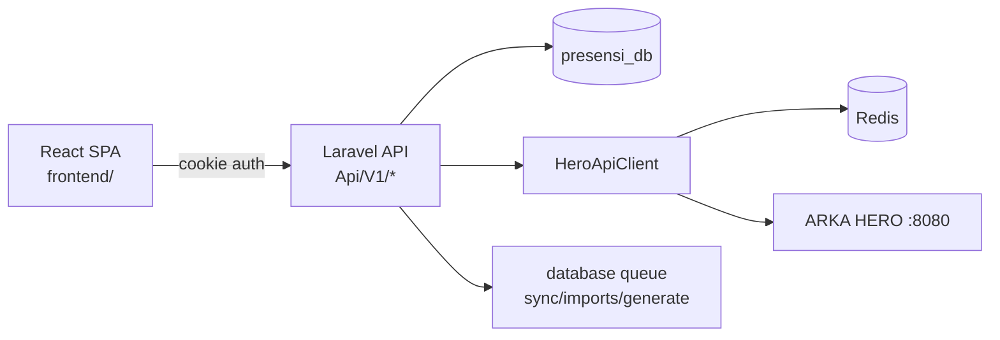

Purpose: Technical reference for understanding system design and development patterns
Last Updated: [Auto-updated by AI]

## Architecture Documentation Guidelines

### Document Purpose

This document describes the CURRENT WORKING STATE of the application architecture. It serves as:

- Technical reference for understanding how the system currently works
- Onboarding guide for new developers
- Design pattern documentation for consistent development
- Schema and data flow documentation reflecting actual implementation

### What TO Include

- **Current Technology Stack**: Technologies actually in use
- **Working Components**: Components that are implemented and functional
- **Actual Database Schema**: Tables, fields, and relationships as they exist
- **Implemented Data Flows**: How data actually moves through the system
- **Working API Endpoints**: Routes that are active and functional
- **Deployment Patterns**: How the system is actually deployed
- **Security Measures**: Security implementations that are active

### What NOT to Include

- **Issues or Bugs**: These belong in `MEMORY.md` with technical debt entries
- **Limitations or Problems**: Document what IS working, not what isn't
- **Future Plans**: Enhancement ideas belong in `backlog.md`
- **Deprecated Features**: Remove outdated information rather than marking as deprecated
- **Wishlist Items**: Planned features that aren't implemented yet

### Update Guidelines

- **Reflect Reality**: Always document the actual current state, not intended state
- **Schema Notes**: When database schema has unused fields, note them factually
- **Cross-Reference**: Link to other docs when appropriate, but don't duplicate content

### For AI Coding Agents

- **Investigate Before Updating**: Use codebase search to verify current implementation
- **Move Issues to Memory**: If you discover problems, document them in `MEMORY.md`
- **Factual Documentation**: Describe what exists, not what should exist

---

# System Architecture

## Project Overview

ARKA PRESENSI automates monthly attendance processing for HR: ingest fingerprint scans, run a deterministic attendance code engine (matrix + HERO leave/LOT data), review/override in a grid, and export Excel reports per site profile.

**Current status (Fase 0 complete):** Laravel 11 API backend + React 18 SPA frontend with Sanctum cookie auth, configuration admin CRUD, HERO API client (cached), and database schema for full attendance pipeline.

## Technology Stack

- **Frontend**: React 18, Vite 8, Ant Design 5, @ant-design/pro-components, React Router, TanStack Query, Axios
- **Backend**: Laravel 11 (PHP 8.3/8.4 pin), Laravel Sanctum (SPA mode), MySQL 8.4 (`presensi_db`), Redis (HERO cache + circuit breaker), database queue driver
- **Infrastructure**: Local dev — `php artisan serve` (:8000) + `npm run dev` in `frontend/` (:5173) with Vite proxy to `/api` and `/sanctum`

## Core Components

### Implemented (Fase 0)

| Component | Location | Purpose |
| --- | --- | --- |
| Auth (Sanctum SPA) | `AuthController`, `frontend/src/pages/Login/` | Session cookie login for SPA |
| Admin CRUD | `SiteController`, `MatrixRuleController`, etc. | Manage sites, matrix, daytype codes, holidays, templates |
| HeroApiClient | `app/Services/HeroApiClient.php` | Read-only HERO API with Redis cache + circuit breaker |
| SyncHeroMasterData | `app/Jobs/SyncHeroMasterData.php` | Upsert `hero_employee_caches`, hourly schedule |
| Dashboard | `DashboardController`, `DashboardPage` | Summary counts (sites, periods) |

### Database Tables (14 domain + Laravel defaults)

`sites`, `matrix_rules`, `site_daytype_codes`, `holiday_calendars`, `report_templates`, `hero_employee_caches`, `employee_maps`, `attendance_periods`, `attendance_sheets`, `attendance_rows`, `attendance_cells`, `attendance_cell_traces`, `fingerprint_imports`, `fingerprint_scans`

## API Endpoints (Fase 0)

- `POST /api/auth/login`, `POST /api/auth/logout`, `GET /api/auth/me`
- `GET /api/dashboard/summary`
- `apiResource` on `/api/sites`, `/api/matrix-rules` (+ `GET /api/matrix-rules/grid`), `/api/site-daytype-codes`, `/api/holiday-calendars`, `/api/report-templates`

## Default Dev Credentials

- Email: `admin@arka.local` / Password: `password`
