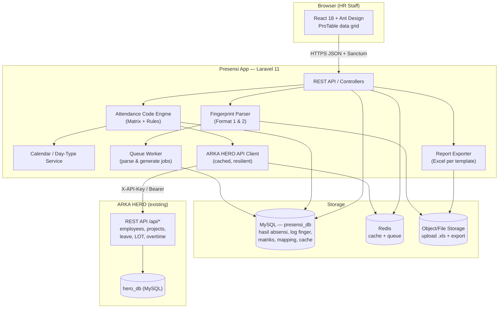
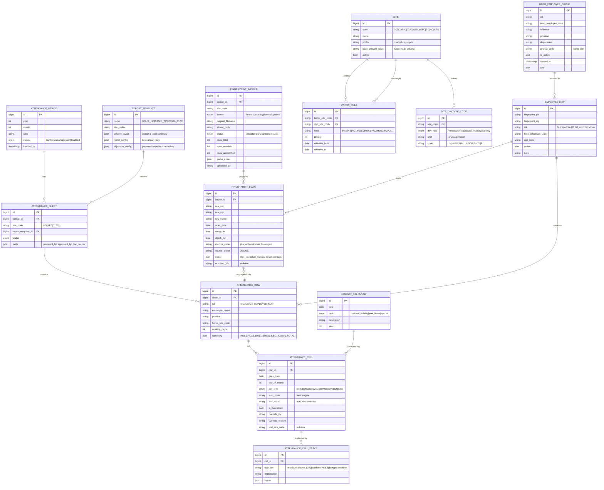
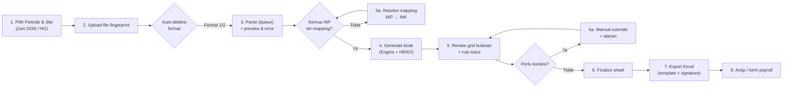
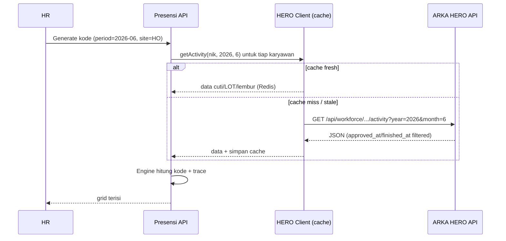
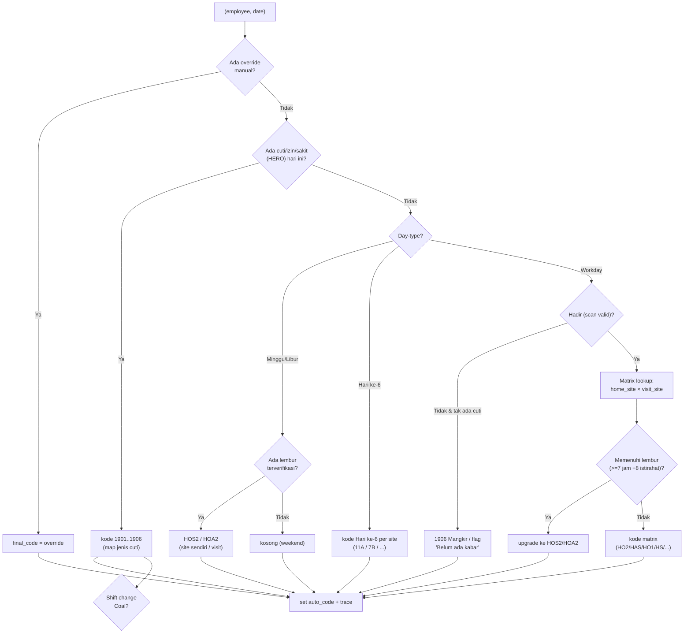

# Presensi App — Concept Document

> **Tagline:** _"Dari mesin fingerprint ke laporan absensi bulanan — otomatis, akurat, siap payroll."_
>
> **Nama aplikasi (usulan):** **ARKA PRESENSI** (internal codename: `presensi-app`)
> **Status:** Greenfield — belum ada codebase. Sibling app **ARKA HERO** sudah berjalan dan menyimpan master data karyawan.
> **Bahasa dokumen:** Bahasa Indonesia dengan istilah teknis English seperlunya.
> **Audiens produk:** Staf HR (bukan end-user umum) — prioritas **efisiensi & akurasi** di atas UI mewah.

---

## Daftar Isi

1. [Ringkasan & Tujuan](#1-ringkasan--tujuan)
2. [Temuan dari Data Nyata](#2-temuan-dari-data-nyata-hasil-analisis-file)
3. [Arsitektur Sistem](#3-arsitektur-sistem)
4. [ERD — Skema Database](#4-erd--skema-database)
5. [Breakdown Modul & Fitur](#5-breakdown-modul--fitur)
6. [UX Flow: Upload → Process → Review → Export](#6-ux-flow-upload--process--review--export)
7. [Konsep Wireframe (Halaman Kunci)](#7-konsep-wireframe-halaman-kunci)
8. [Integrasi dengan ARKA HERO](#8-integrasi-dengan-arka-hero)
9. [Attendance Code Engine (Inti Bisnis)](#9-attendance-code-engine-inti-bisnis)
10. [Fase Implementasi & Milestone](#10-fase-implementasi--milestone)
11. [Open Questions untuk Iwan](#11-open-questions--keputusan-yang-dibutuhkan-dari-iwan)
12. [Special Considerations](#12-special-considerations)

---

## 1. Ringkasan & Tujuan

### Masalah saat ini

HR mengolah absensi secara manual dalam 4 langkah rawan salah:

1. Export data scan fingerprint mentah (Excel) dari mesin absensi.
2. **Melihat matriks kode absensi cetak** dan mencocokkan manual per karyawan.
3. Mengisi kode absensi harian per karyawan di Excel.
4. Menyusun laporan bulanan + statistik ringkasan (lembur, cuti, hari kerja, dll.).

Untuk satu site (~59–85 karyawan × 30 hari) HR mengisi **ribuan sel** secara manual, mereferensi silang matriks 8 site × 7 kolom visit + aturan lembur + kode numerik. Ini memakan hari kerja dan menghasilkan error.

### Solusi

Web app yang **meng-ingest data fingerprint mentah** dan **menghasilkan laporan absensi final otomatis**, dengan:

- Parser untuk **dua format input** (scan-log I/O dan paired in/out).
- **Attendance Code Engine** yang menerapkan seluruh matriks + aturan lembur + kode cuti/izin/sakit.
- Konsumsi **master data karyawan, proyek, cuti, LOT, lembur** dari **ARKA HERO API** (tidak menduplikasi).
- **Manual override** oleh HR untuk kasus khusus.
- **Export Excel** persis format laporan yang berlaku hari ini.

### Prinsip desain

| Prinsip | Implikasi |
| --- | --- |
| **Single source of truth** | Master karyawan/proyek/cuti = ARKA HERO. Presensi App hanya menyimpan hasil olahan absensi + konfigurasi matriks + log fingerprint. |
| **Deterministic engine** | Kode dihasilkan oleh aturan yang bisa dijelaskan/diaudit (bukan "black box"). Setiap sel menyimpan _alasan_ (rule trace). |
| **Human-in-the-loop** | Engine mengusulkan; HR meninjau & override. Override tidak pernah tertimpa saat re-run. |
| **Configurable, not hardcoded** | Matriks kode disimpan di DB dan dikelola lewat Admin UI, bukan di kode. |
| **Idempotent** | Upload ulang / re-generate tidak menggandakan data; hasil konsisten. |

---

## 2. Temuan dari Data Nyata (hasil analisis file)

Analisis langsung terhadap keempat file contoh (Juni 2026) mengungkap detail penting yang membentuk desain:

### 2.1 Input Format 1 — `input-FINGER 000H JUNE 2026.xls` (HO/BO)

- **2.106 baris** scan, **59 NIP unik**, header di baris ke-2 (ada baris kosong di atas).
- Kolom: `Tanggal scan, Tanggal, Jam, PIN, NIP, Nama, Jabatan, Departemen, Kantor, Verifikasi, I/O, Workcode, SN, Mesin`.
- `I/O`: `1.0` = check-in, `2.0` = check-out. **Bisa banyak pasang scan per hari**.
- **Temuan kritis:** kolom `Jabatan, Departemen, Kantor` **kosong** di data mentah; hanya ada **satu mesin** (`Mesin 2`, SN `616272019100456`). → **Lokasi visit TIDAK bisa dideteksi dari mesin.** Harus dari catatan manual / data LOT ARKA HERO.
- `PIN` = `NIP` (mis. `53`) — **berbeda** dari `NIK` di laporan (mis. `10022`). → butuh **mapping fingerprint→NIK**.

### 2.2 Input Format 2 — `input-Finger Karyawan APS June 2026.xls` (APS)

- **2 sheet:** `30` (karyawan periode penuh, 2.262 baris, 70 NIP) dan **`DNC`** (mid-month joiner / periode parsial).
- Kolom: `Tanggal, NIP, Nama, Scan masuk, Scan pulang, (kosong), Terlambat/Ijin, ..., Tidak Finger Print Masuk, Tidak Finger Print Keluar, Visit ke HO, Belum ada Berkas Pendukung (LOT/Form Cuti/Surat Sakit)`.
- **Sudah paired**: satu baris = satu karyawan-hari.
- **Temuan kritis:** sel `Scan masuk` **bisa berisi kode langsung** (mis. `1901`) alih-alih jam — artinya input Format 2 sudah setengah-diproses HR. Parser harus mengenali "nilai = jam" vs "nilai = kode".
- Kolom `Visit ke HO` dan `Belum ada Berkas Pendukung` adalah **catatan manual** → sumber sinyal visit & flag dokumen.

### 2.3 Expected Output — `expected_result-STAFF_000H_JUNE_2026.xlsx` (HO)

- **86 baris** total (85 data + header), **48 kolom**. Layout:
  - Baris 2–3 = header dua tingkat. Kolom `No, Nama, NIK, Position`, lalu **30 kolom tanggal** (1–30 Juni), lalu summary.
  - **Summary HO:** `LEMBUR STAFF` → (`HOS2`, `HOA2`, `TOTAL`), `1901`, `1902`, `1903`, `1904`, `1905`, `1906`, `SC1`, `TOTAL`.
  - **Footer keterangan:** `Terlambat`, `Tidak Finger Print Masuk`, `Tidak Finger Print Keluar`, `ID Ketinggalan`, `Visit ke APS`, `Belum ada Berkas Pendukung (LOT/Form Cuti/Surat Sakit)`, `Belum ada kabar`.
  - **Signature block:** `Checked, / Approved,` + nama + jabatan + `Rev.1`.
- **Distribusi kode nyata (sel tanggal):** `HO2`×1089, `HOA2`×102, `HOS2`×97, `1901`×70, `HS`×25, `HAS`×10, `1902`×18, `1903`×2, `SC1`×2.
- **Weekend = sel kosong** (Sabtu/Minggu tidak diisi kode hadir).

### 2.4 Expected Output — `expected_result-STAFF_APS_JUNE_2026.xls` (APS)

- **44 baris** (≈40 data), **47 kolom**. Ada **judul**: `ABSENSI KARYAWAN PERIODE 01 - 30 JUNI 2026 (ARKA PROJECT SUPPORT# APS)`.
- **Summary APS:** `Sabtu`, `HOS2`, `HOA2`, `1901..1906`, `SCB`, `Kosong`, `TOTAL`, `HARI KERJA`.
- **Signature block:** `Prepared by (HR Supervisor APS) / Approved By (Project Manager)` + **document control** `ARKA/HCS/IV/02.01 Rev.2 Page 1/1`.
- **Distribusi kode:** `HO2`×636, `1901`×31, `HOA2`×27, `HOS2`×5, `1904`×1.

### 2.5 Implikasi desain dari temuan

| Temuan | Implikasi desain |
| --- | --- |
| Dua summary berbeda (HO vs APS) | Template export **per site-profile**, bukan satu template kaku. |
| Weekend kosong + kolom `Sabtu`/`HARI KERJA` | Butuh **calendar/day-type** service (hari kerja, Sabtu, Minggu, libur nasional, hari ke-6/7). |
| Kode bisa muncul di kolom input | Parser toleran: bedakan jam vs kode; kode manual diterima apa adanya. |
| NIP ≠ NIK, mesin tunggal, kolom kosong | Butuh **mapping table** + **sumber visit dari catatan/LOT**, bukan dari mesin. |
| Sheet `DNC` | Dukung **karyawan periode parsial** (join/resign tengah bulan) → `HARI KERJA` dihitung proporsional. |
| Signature & doc-control | Metadata laporan (prepared/approved/by, revisi, nomor dokumen) harus **configurable** per template. |

---

## 3. Arsitektur Sistem

Arsitektur **decoupled**: React SPA (AntD) → Laravel API (Presensi) → MySQL (DB Presensi sendiri) + integrasi read-only ke **ARKA HERO API**.

### Komponen kunci

- **Fingerprint Parser** — dua strategy (Format 1 = agregasi scan I/O menjadi pasangan harian; Format 2 = pasangan siap, plus baca kode manual). Berjalan di **queue** karena file besar (2rb+ baris).
- **Attendance Code Engine** — inti bisnis (§9). Input: presence harian + konteks karyawan (home site, visit, day-type, cuti/LOT/lembur). Output: kode + rule-trace.
- **Calendar / Day-Type Service** — menentukan hari kerja / Sabtu / Minggu / libur nasional / hari ke-6 / hari ke-7.
- **ARKA HERO API Client** — read-only, **cached** (Redis) + **circuit breaker** untuk konektivitas buruk di site.
- **Report Exporter** — render laporan Excel sesuai template site-profile (HO / APS / Coal), termasuk summary & signature block.

---

## 4. ERD — Skema Database

Presensi App **tidak** menyimpan master karyawan/proyek/cuti. Ia menyimpan: **snapshot cache** dari HERO (untuk offline & performa), **log fingerprint**, **hasil absensi harian & bulanan**, **konfigurasi matriks**, dan **mapping NIP→NIK**.

### Catatan skema

- **`ATTENDANCE_CELL.auto_code` vs `final_code`** — memisahkan hasil engine dari keputusan HR; re-generate hanya menyentuh `auto_code`, `final_code` yang di-override tetap aman (`is_overridden`).
- **`ATTENDANCE_CELL_TRACE`** — audit trail per sel ("kenapa kode ini?"). Krusial untuk kepercayaan HR & debugging aturan.
- **`EMPLOYEE_MAP`** — jembatan NIP fingerprint ↔ NIK HERO; satu-satunya tempat mapping dikelola.
- **`HERO_EMPLOYEE_CACHE`** — snapshot data HERO agar app tetap jalan saat HERO down / site offline; `synced_at` untuk refresh.
- **`MATRIX_RULE` versioned** (`effective_from/to`) — matriks bisa berubah tahun ke tahun (mis. 1907→1904) tanpa merusak laporan historis.

---

## 5. Breakdown Modul & Fitur

### 5.1 Modul: Import Fingerprint

| Fitur | Deskripsi |
| --- | --- |
| Upload multi-format | Terima `.xls/.xlsx`; auto-deteksi Format 1 vs 2 dari signature kolom. |
| Preview & validasi | Tampilkan sample baris ter-parse + daftar error (NIP tak dikenal, tanggal invalid). |
| Multi-sheet | Baca sheet `30` **dan** `DNC` (APS) sebagai satu import. |
| Agregasi I/O | Format 1: gabungkan scan `1`/`2` per NIP-hari → `check_in` (paling awal) / `check_out` (paling akhir). |
| Deteksi kode manual | Jika sel scan berisi kode (`1901`), simpan sebagai `manual_code`. |
| Matching report | Ringkasan matched / unmatched, tombol resolve mapping. |

### 5.2 Modul: Employee Mapping

- Kelola `EMPLOYEE_MAP` (NIP↔NIK), auto-suggest via nama/NIK dari HERO cache.
- Bulk import mapping; tandai NIP aktif/nonaktif.
- Unmatched queue: NIP yang belum punya mapping ditahan agar HR selesaikan sebelum generate.

### 5.3 Modul: Attendance Code Engine (§9)

- Generate kode harian per karyawan berdasarkan matriks + day-type + cuti/LOT/lembur HERO.
- Simpan `auto_code` + rule-trace; hitung summary per baris.

### 5.4 Modul: Review & Override

- Grid bulanan (AntD ProTable): baris = karyawan, kolom = tanggal + summary.
- Klik sel → edit kode, lihat rule-trace, tulis alasan override.
- Bulk action: set kode untuk range tanggal / banyak karyawan (mis. libur bersama).
- Indikator visual: auto vs override, unmatched, konflik (scan ada tapi cuti juga ada).

### 5.5 Modul: Report Export

- Export Excel per template (HO / APS / Coal) — layout, summary, footer, signature persis format berlaku.
- Metadata: periode, prepared/approved by, nomor dokumen, revisi.
- Export PDF (opsional Fase 2) untuk arsip tanda tangan.

### 5.6 Modul: Matrix & Master Config (Admin)

- CRUD `SITE`, `MATRIX_RULE` (grid site×visit), `SITE_DAYTYPE_CODE`, kode numerik, aturan lembur.
- Versioning matriks (`effective_from/to`).
- `HOLIDAY_CALENDAR` per tahun (input manual / import).
- `REPORT_TEMPLATE` builder (kolom summary, footer, signature).

### 5.7 Modul: Integrasi HERO

- Sinkronisasi berkala master (employees, projects, positions, departments) → `HERO_EMPLOYEE_CACHE`.
- On-demand fetch aktivitas (cuti/LOT/lembur) per karyawan-periode untuk engine.

### 5.8 Modul: Dashboard & Audit (Fase 2)

- Status harian, keterlambatan, absen, ringkasan lembur.
- Audit log override & perubahan matriks.

---

## 6. UX Flow: Upload → Process → Review → Export

**Narasi flow (perspektif HR):**

1. **Pilih periode & site** — HR memilih bulan (Juni 2026) dan site (HO). Sistem membuat/membuka `ATTENDANCE_PERIOD` + `ATTENDANCE_SHEET`.
2. **Upload** file `.xls` dari mesin fingerprint. Sistem mendeteksi format otomatis.
3. **Parse & validasi** berjalan di background; HR lihat preview + daftar NIP tak dikenal.
4. **Resolve mapping** bila ada NIP baru (sekali saja per karyawan).
5. **Generate** — engine mengisi seluruh grid otomatis, menarik cuti/LOT/lembur dari HERO.
6. **Review** di grid; HR memeriksa sel yang di-flag (konflik/unmatched), melihat _alasan_ tiap kode, dan **override** bila perlu (dengan alasan tercatat).
7. **Finalize** — sheet dikunci; **export Excel** yang identik format lama, siap ditandatangani & diserahkan ke payroll.

---

## 7. Konsep Wireframe (Halaman Kunci)

Deskripsi tekstual (bukan pixel-perfect) — gaya AntD, padat data, keyboard-friendly.

### 7.1 Dashboard Periode
- Header: dropdown **Periode** + **Site**, badge status (`Draft / Processing / Review / Finalized`).
- Kartu ringkas: total karyawan, matched/unmatched, sel override, hari libur bulan ini.
- Tombol utama: **Upload Fingerprint**, **Generate**, **Export**.

### 7.2 Upload & Parse Result
- Dropzone file + indikator progress (queue).
- Tab **Preview** (tabel sample) & **Errors** (baris bermasalah + alasan).
- Panel **Unmatched NIP** dengan tombol _Map to NIK_ (auto-suggest dari HERO cache).

### 7.3 Review Grid (halaman inti) — AntD ProTable
- Kolom kiri **frozen**: `No, Nama, NIK, Position`.
- **30 kolom tanggal** (header menampilkan tanggal + nama hari; kolom Sabtu/Minggu/libur diberi warna).
- Kolom kanan **summary** (dinamis per template): `HOS2, HOA2, TOTAL LEMBUR, 1901..1906, SC1/SCB, Kosong, TOTAL, HARI KERJA`.
- **Sel:** klik → popover berisi kode terpilih, dropdown kode valid, **rule-trace** ("HO home, visit HO, workday → HO2"), input alasan override.
- Legend warna: auto (netral), override (kuning), konflik (merah), libur (abu).
- Toolbar: filter (unmatched/override/konflik), bulk-set range tanggal, refresh dari HERO.

### 7.4 Matrix Config (Admin)
- Grid **Site (baris) × Visit Site (kolom)** editable — mereplika matriks cetak, sel = kode.
- Tab terpisah: **Kode Numerik** (1901–1906), **Coal Shift** (SC1/OFF), **Day-Type per Site** (11/11A/11B/SCB/7/8/7B/B), **Aturan Lembur**.
- Toggle **effective period** untuk versioning.

### 7.5 Report Template Builder
- Konfigurasi urutan & label kolom summary, baris footer keterangan, blok signature (prepared/approved/by, jabatan, nomor dokumen, revisi).
- Preview render sebelum export.

---

## 8. Integrasi dengan ARKA HERO

### 8.1 Endpoint yang dikonsumsi

| Kebutuhan Presensi | Endpoint HERO | Catatan |
| --- | --- | --- |
| Master karyawan (NIK, nama, posisi, dept, **home site**) | `GET /api/employees`, `/active` | `project_code` = home site. Cache ke `HERO_EMPLOYEE_CACHE`. |
| Lookup 1 karyawan | `GET /api/employees/by-nik/{nik}` | Saat resolve mapping. |
| Proyek/site aktif | `GET /api/projects` | Seed daftar `SITE`. |
| Posisi & departemen | `GET /api/positions`, `/api/departments` | Label laporan. |
| **Cuti** dalam periode | `GET /api/workforce/employees/by-nik/{nik}/leave-requests?year&month` | Filter `approved_at`. → kode `1901..1905`. |
| **LOT / perjalanan dinas** | `.../official-travels?year&month` | **Sumber utama sinyal VISIT SITE** (destination). |
| **Lembur** | `.../overtime-requests?year&month` | `finished_at`; untuk `HOS2/HOA2` + aturan 7 jam. |
| Aktivitas gabungan | `.../activity?year&month` | Sekali panggil = cuti+LOT+lembur+summary (efisien). |

**Auth:** `X-API-Key` / `Authorization: Bearer <API_KEY>`, header `Accept: application/json`.

### 8.2 Pola integrasi

- **Resilience:** circuit breaker + fallback ke `HERO_EMPLOYEE_CACHE`. Jika HERO tak terjangkau, engine tetap jalan untuk bagian hadir/kalender; blok cuti/LOT/lembur ditandai "perlu refresh".
- **Batch:** gunakan endpoint `activity` (gabungan) untuk minimalkan round-trip; throttle-aware (HERO ada rate limit `429`).
- **Konsistensi JSON:** normalisasi pola `status`/`success` yang berbeda antar endpoint di lapisan client.

### 8.3 NIP/NIK matching (keputusan penting)

Fingerprint memakai **PIN/NIP** (mis. `53`, `0199`) yang **tidak sama** dengan **NIK** HERO (`10022`, `10750`). Strategi:

1. **Tabel `EMPLOYEE_MAP`** sebagai kanonik (NIP → NIK → HERO UUID).
2. Auto-suggest saat pertama kali NIP muncul (cocokkan nama fuzzy + NIK ke HERO cache).
3. Mapping bersifat **persisten**; sekali diset, dipakai lintas periode.
4. Jika NIP tak ter-map → masuk **unmatched queue**, generate diblok sampai diselesaikan (mencegah karyawan hilang dari laporan).

---

## 9. Attendance Code Engine (Inti Bisnis)

Engine = **pipeline aturan berprioritas** per _(karyawan, tanggal)_. Setiap tahap bisa menetapkan kode final atau melanjutkan ke tahap berikut. Semua keputusan menghasilkan **trace**.

### 9.1 Input per sel

- `home_site` (dari HERO `project_code`).
- `presence` harian (check_in/out atau `manual_code`) dari `FINGERPRINT_SCAN`.
- `visit_site` (dari LOT HERO / kolom "Visit ke ..." / catatan manual).
- `day_type` (dari Calendar Service).
- `leave/overtime` (dari HERO activity).

### 9.2 Urutan resolusi (priority pipeline)

### 9.3 Matriks Visit Site (dari `kode-absensi-matrix.md`)

Disimpan di `MATRIX_RULE` (home_site × visit_site → code). Baseline (kolom "Kode Hadir bekerja") = kasus **home = visit**.

| Home \ Visit | (home) | BO | HO | APS | 017C/022C/023C | 021C | 025C |
| --- | --- | --- | --- | --- | --- | --- | --- |
| 017C | HAS | HS | HS | HS | HAS | HS | HS |
| 021C | HO1 | HO1 | HOS1 | HOS1 | HOA1 | HO1 | HOS1 |
| 022C | HAS | HS | HS | HS | HAS | HS | HS |
| 023C | HAS | HS | HS | HS | HAS | HS | HS |
| BO | HO1 | HO1 | HOS1 | HOS1 | HOA1 | HO1 | HOS1 |
| HO | HO2 | HOS2 | HO2 | HO2 | HOA2 | HOS2 | HOS2 |
| APS | HO2 | HOS2 | HO2 | HO2* | HOA2 | HOS2 | HOS2 |
| 025C | HO1 | HOS1 | HOS1 | HOS1 | HOA1 | HOS1 | — |

\* Sel diagonal kosong (APS→APS) = kode baseline **HO2** (aturan "site sendiri").
Aturan pengisian diagonal: **jika home = visit → pakai baseline "Kode Hadir bekerja".**

### 9.4 Kode numerik (cuti/izin/sakit)

| Kode | Arti | Sumber |
| --- | --- | --- |
| 1901 | Cuti | HERO leave (jenis cuti tahunan) |
| 1902 | Izin dibayar | HERO leave / manual |
| 1903 | Izin tidak dibayar | HERO leave / manual |
| 1904 | Sakit dibayar (surat dokter) | HERO leave — **menggantikan 1907** (mulai 2025) |
| 1905 | Sakit tidak dibayar | HERO leave / manual |
| 1906 | Mangkir | Tidak hadir tanpa keterangan |

### 9.5 Coal shift change & day-type per site

- **SC1** = change shift **di** site; **OFF** = change shift **tidak** di site.
- `SITE_DAYTYPE_CODE`: hari kerja / off (`SCB`) / hari ke-6 / hari ke-7 & libur / standby (`7`), termasuk shift pagi vs malam 017C (`11` vs `11/NS`, `11A/11B` vs `11/NSA/11/NSB`); APS (`8`, `7B`, `B`).

### 9.6 Aturan lembur (upgrade kode)

- **HOS2** = lembur di site sendiri; **HOA2** = lembur saat visit site lain.
- **OB Mess Regency:** lembur jam kerja → `HOS2`; lembur 24 jam → **kode dikosongkan** (benefit terpisah).
- **OB HO:** lembur hari libur/jam kerja → `HOS2`; **dua sesi di satu hari libur** → sesi kedua **dipindah ke hari lain di bulan sama** (engine mengusulkan tanggal kosong; HR konfirmasi).
- **Staff & Non-Staff:** minimal **7 jam kerja + 8 jam istirahat**; jika tidak, **tidak dihitung** lembur (tetap kode hadir biasa).

### 9.7 Perhitungan summary per baris

- `HOS2`, `HOA2` = count kode terkait; `TOTAL LEMBUR` = HOS2+HOA2.
- `1901..1906` = count masing-masing.
- `SC1`/`SCB`, `Kosong` = count.
- `HARI KERJA` = jumlah hari-kerja efektif (workday non-libur, dikurangi cuti/mangkir sesuai definisi payroll — **perlu konfirmasi rumus final ke Iwan**).
- Untuk karyawan **DNC** (parsial), `HARI KERJA` dihitung dari tanggal join/aktif.

### 9.8 Determinisme & audit

Setiap sel menulis `ATTENDANCE_CELL_TRACE` (`rule_key`, `explanation`, `inputs`). Re-generate bersifat idempoten dan tidak menimpa sel `is_overridden`.

---

## 10. Fase Implementasi & Milestone

### Fase 0 — Fondasi (1–2 minggu)
- Scaffold Laravel 11 + React/AntD + Docker; auth (Sanctum).
- HERO API Client + `HERO_EMPLOYEE_CACHE` sync (employees, projects, positions).
- Seed `SITE`, `MATRIX_RULE`, `SITE_DAYTYPE_CODE`, `HOLIDAY_CALENDAR` dari matriks cetak.
- **Milestone:** bisa tarik & tampilkan daftar karyawan + matriks dari config.

### Fase 1 — MVP (inti otomasi)
1. Parser Format 1 & 2 (+ sheet DNC) via queue.
2. Employee mapping (NIP→NIK) + unmatched queue.
3. Attendance Code Engine (matriks + day-type + cuti/LOT/lembur + trace).
4. Review grid + manual override.
5. Export Excel (template HO & APS) identik format lama.
6. Admin matrix config.
- **Milestone (Definition of Done):** untuk Juni 2026, output aplikasi **cocok** dengan `expected_result-*` (target ≥95% sel; sisanya kasus manual yang wajar).

### Fase 2 — Enhancement
7. Integrasi mesin langsung (API/webhook), bypass Excel.
8. Real-time dashboard (telat/absen/lembur harian).
9. Auto-hitung jam lembur + aturan 7/8 jam otomatis.
10. Multi-month view & komparasi.
11. Integrasi leave balance HERO.
12. Export PDF bertanda tangan + audit log lengkap.

### Validasi (lintas fase)
- **Golden-file test:** file Juni 2026 sebagai fixture regresi; setiap perubahan engine di-diff terhadap expected output.

---

## 11. Open Questions & Keputusan yang Dibutuhkan dari Iwan

1. **Database — terpisah atau shared?** → **Rekomendasi: terpisah** (`presensi_db`) + integrasi API read-only ke HERO. Menjaga decoupling, izin, dan siklus rilis. _Setuju?_
2. **Penyimpanan matriks** → **Rekomendasi: DB tables** (`MATRIX_RULE`, `SITE_DAYTYPE_CODE`) + Admin UI, dengan versioning `effective_from/to` (bukan JSON hardcoded). _Setuju?_
3. **Penentuan day-type / libur nasional** → **Rekomendasi: tabel `HOLIDAY_CALENDAR`** yang di-input HR per tahun (opsional import). Butuh sumber resmi libur nasional + cuti bersama ARKA. _Sumbernya apa?_
4. **Deteksi visit site** — data mesin **tidak** memuat lokasi (satu mesin, kolom kantor kosong). → **Rekomendasi: LOT dari HERO** sebagai sumber utama + kolom catatan "Visit ke ..." + override manual. _Cukup, atau ada sumber lain?_
5. **Rumus `HARI KERJA` & `TOTAL`** — definisi persis (apakah cuti/mangkir mengurangi hari kerja? bagaimana hari ke-6/lembur dihitung?). **Butuh spesifikasi payroll dari Iwan.**
6. **Mangkir (1906) vs "Belum ada kabar"** — kapan sel kosong menjadi mangkir vs sekadar flag tindak lanjut? Perlu aturan cut-off.
7. **Aturan "sesi kedua dipindah ke hari lain" (OB HO)** — apakah engine boleh memilih tanggal otomatis, atau selalu keputusan HR?
8. **Karyawan lintas laporan** — data menunjukkan karyawan HO (mis. Nurhayani 10750) muncul di laporan APS. Bagaimana aturan penempatan karyawan ke sheet site tertentu?
9. **PHP 8.5 & Laravel Excel** — lihat §12; perlu keputusan versi PHP / library export.
10. **Retensi & finalisasi** — setelah finalize, apakah boleh re-open? Kebijakan audit/lock periode.
11. **Autentikasi & role** — siapa boleh generate/override/finalize/kelola matriks? (HR staff vs HR supervisor vs admin).

---

## 12. Special Considerations

### 12.1 PHP 8.5 + PhpSpreadsheet / Laravel Excel
- `maatwebsite/excel` bergantung pada `phpoffice/phpspreadsheet`, yang **mungkin belum kompatibel penuh dengan PHP 8.5** (deprecations/breaking).
- **Opsi:**
  1. **Pin PHP 8.3/8.4** untuk container Presensi (paling aman, konsisten dengan ekosistem ARKA). _Rekomendasi awal._
  2. Gunakan **library ringan** khusus (mis. `openspout/openspout`) untuk baca/tulis XLSX streaming — hemat memori untuk file 2rb+ baris, bebas dari sebagian isu PhpSpreadsheet.
  3. Tunggu rilis PhpSpreadsheet yang mendukung 8.5.
- **Parsing `.xls` legacy (BIFF)** dari mesin fingerprint: pastikan library mendukung format `.xls` lama (bukan hanya `.xlsx`). openspout hanya XLSX/CSV → untuk `.xls` mungkin tetap perlu PhpSpreadsheet atau konversi awal.

### 12.2 Multi-site & konektivitas
- Site tambang bisa berkoneksi buruk → **cache HERO** + circuit breaker; engine jalan offline dengan data cache; sinkron ulang saat online.
- Semua operasi berat (parse, generate, export) di **queue** agar UI responsif.

### 12.3 Konsistensi dengan ekosistem ARKA
- Ikuti pola HERO: Laravel 11 skeleton, Sanctum, Docker di VPS.
- **Jangan duplikasi** master data — selalu konsumsi via API; Presensi hanya pemilik data absensi & konfigurasi matriks.

### 12.4 Domain payroll/akuntansi (untuk Iwan)
- Kode absensi bermuara ke **komponen insentif/premium** — akurasi = uang. Karena itu: rule-trace per sel, versioning matriks, golden-file regression, dan lock periode setelah finalize.
- Perubahan kebijakan historis (1907→1904 sejak 2025) ditangani lewat `effective_from/to` agar laporan lama tetap reproducible.

### 12.5 Skala & performa
- ~85 karyawan × 30 hari × banyak site ≈ puluhan ribu sel/bulan — ringan untuk MySQL, tapi panggilan HERO per-karyawan harus **di-batch/cache** untuk hindari `429`.

---

_Dokumen ini adalah titik awal diskusi. Poin di §11 perlu keputusan Iwan sebelum Fase 1 dimulai._
